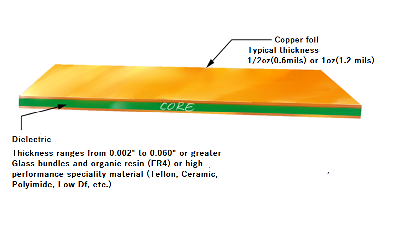
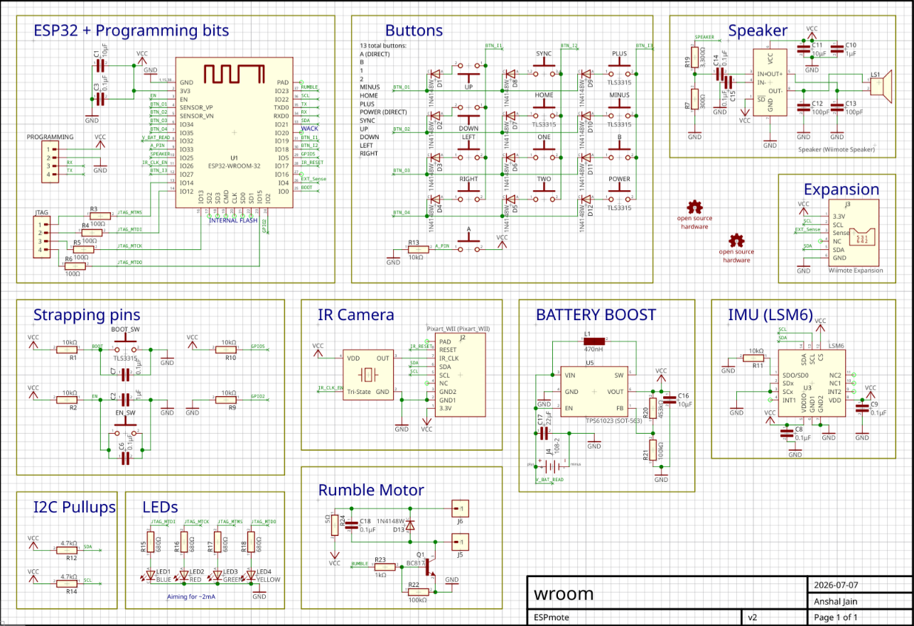
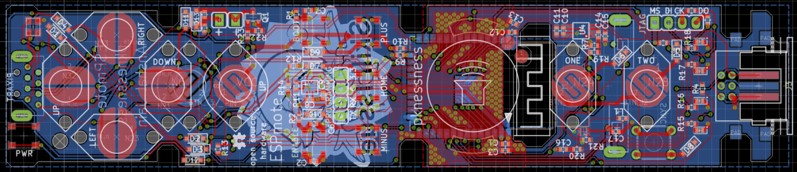
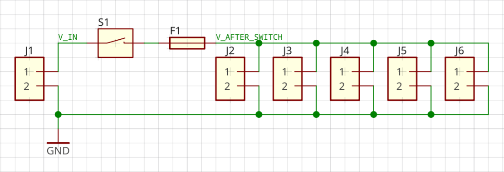

# PCB Introduction

## What is a PCB? (PART 1 VIDEO)

A PCB (Printed Circuit Board) is an optimized physical form of a circuit. It is like a breadboard but permanent and specialized for this exact circuit and exact task.

PCBs are made of alternating layers of copper and a dielectric, usually fiberglass. The simplest form of pcb that we use is 2 copper layers sandwiching a single layer of dielectric, as shown here.

PCBs can also be made with more layers in between with more layers of dielectric, but for many use cases you can simply go with the cheaper option, which is this 2-Layer board.

We solder our components to the PCB where the exposed copper allows us connection. The rest of the solder is masked off with a film that prevents us from making unwanted connections.

The general PCB design workflow after you figure out what exactly the goal of your board is, starts with you selecting the parts you want for your application and designing a schematic using those parts, and then turning that schematic into a board.

### Parts

When we say parts, we mean the physical components themselves that we are arranging to creat our circuit, like capacitors, inductors, resistors, integrated circuits, connectors, etc. Later we will go into more depth into speccing parts and the parameters that matter and those that don't.

### Schematics

Schematics are more like a higher level description of how every part connects to each other. In a schematic, all your parts that you've chosen are represented as symbols and you choose how you want them to be connected electrically. (This LED cathode needs to connect to ground and the Anode needs to connect to 5v, etc.), but we're not yet thinking about how those wires will be routed. 

Here you can see an example of a relatively complex schematic I designed around an ESP32 board, an IMU, some buttons, LEDs, and battery charging.

### Boards (Layout)

The final part of the workflow is the board. Once you've completed your schematic you now choose where the parts go and where the traces go that connect them. When laying components out, you need to consider placement conditions unique for each component, but we will discuss those later when we talk more about in-depth board design.

Your main tools of connection are 

- Traces, which are basically copper wires

- Vias, which are drilled holes with metal plating that lets you connect traces of different layers

- Copper areas, which are literally large plates of copper, basically if a trace is a line, a copper area is a polygon covering an area

- Pads, which are bits of copper exposed so that you can solder parts to the board. 

The board will be the physical result of your work.

## EasyEDA Demo (PART 2 VIDEO)

### Parts/Schematic

The first thing you need to figure out is what exactly do you want this pcb to do. Lets say I want to make a simple breakout board that connects one connector to 5 others through a switch and a fuse. 

My first goal is to lay out what I want in an electrical diagram, so I can define what I want to connect to what.

So here I have defined an input connector (J1), 5 output connectors (J2-J6), a switch (S1), and a fuse (F1). This is how I want the pins of these 8 devices to connect. For this example I am using male and female dupont connectors, with any dip switch and a 1A PTC Fuse. You will need to define the components you want to use before you move on to the next step, which is component layout on the board.

[CREATE SCHEMATIC IN VIDEO AND DESCRIBE THE PROCESS OF PLACING PARTS AND CONNECTING THEM, NETS, GOOD PRACTICES, NOTATION]

### Board

Now it's time to make the board

[CREATE BOARD IN VIDEO AND DESCRIBE THE PROCESS OF LAYING OUT TRACES, GROUND PLANES, WHAT FOOTPRINTS AND COURTYARDS MEAN, ETC.] [THIS IS BASICALLY THE EASYEDA INTRO VIDEO]

## Assignment:

For this week we will have a basic assignment which is to make an account on easyEDA and to create the schematic for a four-way rectifier. You can use any connectors for the in and out.

## Quiz: Basic ~5 question google quiz making sure recruits understand the important parts of this week.

##### Notes to self:

- spec resistors for i2c

- capacitor smoothing for frequency

- multiple capacitors being more useful than one

- specific protocols (CAN, I2C, SPI) specifics

- run through designing a breakout schematic/board

- run through designing an rectifier schematic/board

- board trace rules
  
  - dont parallel unrelated traces (perpindicular is best)
  
  - trace width rules
  
  - planes, gnd planes and why mentality (guang mini-manifesto)
  
  - rf and high freuqncy rules

FUTURE: schematic practices (decoupling capacitors, organization, etc.)

FUTURE: board layout rules (trace width, high frequency shit, keepout, mounting holes, issues with plugging in cables or pressing latches (for certain connectors), sometimes parts have location requirements, sometimes those location requirements are relative to other components or other traces)
