# PCB Design - Concepts

Welcome to week 1!

This document covers the basics of PCB design with a focus on how different circuit elements behave both in theory and in practice. You'll also learn the fundamentals of PCB design which you'll later apply in **PCB Design - Project**.

## Part 1: Circuit Fundamentals

In this section, we will first cover the fundamental mathematical equations that are necessary in designing and analyzing any circuit. 

### Ohm and Kirchoff's laws

1. Ohm's law tells us the relationship between voltage, current, and resistance in a circuit:
$$\large V = I \cdot R$$

Where voltage $V$ is the difference in potential between two points in volts, current $I$ is the flow of electrical charge through those points in amperes, and $R$ is the resistance of the material or element in Ohms ($\Omega$).

2. Kirchoff's Voltage Law (KVL) tells us that in any closed loop, the total voltage gained minus the total voltage lost is equal to zero.

$$\large V_{gained} = V_{lost}$$

3. Kirchoff's Current Law (KCL) tells us that, for any node, the total current entering minus the total current leaving is equal to zero.

$$\large I_{entering} = I_{leaving}$$

At this point, if any of these concepts are confusion for you, please take the time to review the following videos to get familiar with them. These are fundamental concepts you need to design even the most basic circuits.

[KVL KCL](https://www.youtube.com/watch?v=Fes12AtcNP8&list=PLVj6MdQ5TaaU-0PfmpqB7lxdYP-denj2G&index=9)

[OHM's law and basic elements](https://www.youtube.com/watch?v=AAJIeD_U_cU&list=PLVj6MdQ5TaaU-0PfmpqB7lxdYP-denj2G&index=7)

## Part 2: Circuit Elements 

In this part, we'll cover the basic theory behind passive elements (resistors, capacitors, inductors, diodes) which are commonly used in PCB design.

---

### Resistors

Resistors are passive components that oppose the flow of current and dissipate the energy they drop as heat. The relationship between the voltage across a resistor and the current through it can be determined using Ohm's Law.

Take this circuit for example:

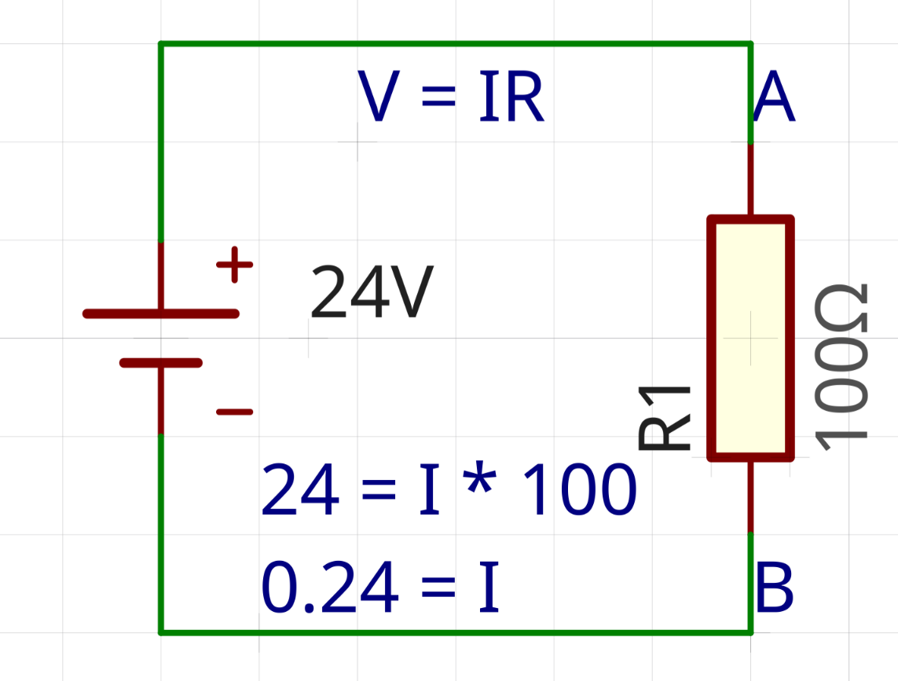

Since we're given two out of three unknowns ($V$ & $R$, need $I$), we can find the current $I$ through the resistor directly. $V$ is the voltage difference between the ends of the resistor (nodes A and B) = $24V$ and $R$ is the resistance of the resistor = ($100\Omega$), so the current $I$ = $24V / 100\Omega = 0.24A$.

The chemical energy of the battery is dissipated by the resistor as heat. Exactly how much power the resistor dissipates can represented by the power equation, given by $P = IV = I^2R, where $P$ is the power received by the resistor, in watts. In the example above, the resistor burns $P = (0.24A)^2 \times 100\Omega = 5.76W$.

#### Combining resistors

Most circuits use more than one resistor, so you need to be able to collapse a group of them into a single equivalent resistance.

Resistors in series are connected end to end, and their resistances simply add:

$$\large R_{eq} = R_1 + R_2 + ... + R_n$$

Resistors in parallel share the same two connection points, and combine like this instead:

$$\large \frac{1}{R_{eq}} = \frac{1}{R_1} + \frac{1}{R_2} + ... + \frac{1}{R_n}$$

For the two-resistor case, that simplifies to a form you'll end up using constantly:

$$\large R_{eq} = \frac{R_1 R_2}{R_1 + R_2}$$

When wiring a circuit, note that bare wires have resistance too, and that resistance causes a voltage drop and power dissipation along the length of the trace, usually called IR drop. The resistance of a wire or trace is given by the following relationship:

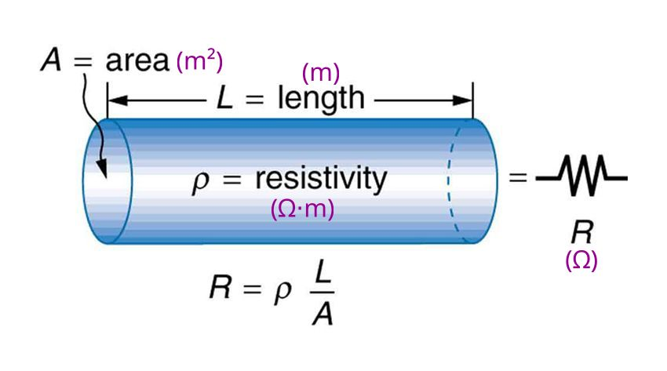

On a small board carrying any real current, trace resistance can become a real problem.
 The important part is that a wire's cross-sectional area is inversely proportional to its resistance (and IR drop). The wider the trace, the less resistance it has, and the less it limits current. If you expect a lot of current, you must increase the width of your trace (exactly how much can be calculated using the IPC-2221 standard). 

**Additional resources**

[Combining resistors](https://www.youtube.com/watch?v=s_Xinpu7QAU&list=PLVj6MdQ5TaaU-0PfmpqB7lxdYP-denj2G&index=10)

[Power](https://www.youtube.com/watch?v=R1uiMv68vsw&list=PLVj6MdQ5TaaU-0PfmpqB7lxdYP-denj2G&index=5)

#### Reading Question 1

a.) What is the resistance $R$ of a circular wire of radius $0.1mm$ and length $10m$, given $\rho = 1.68 \cdot 10^{-8} \Omega \cdot m$?

b.) In the following circuit, the same length and thickness of wire is used to connect a 3V source to a 100 $\Omega$ load represented by $R_L$. Find what percentage of the power is lost. (Hint: you can express the wire as a series resistor)

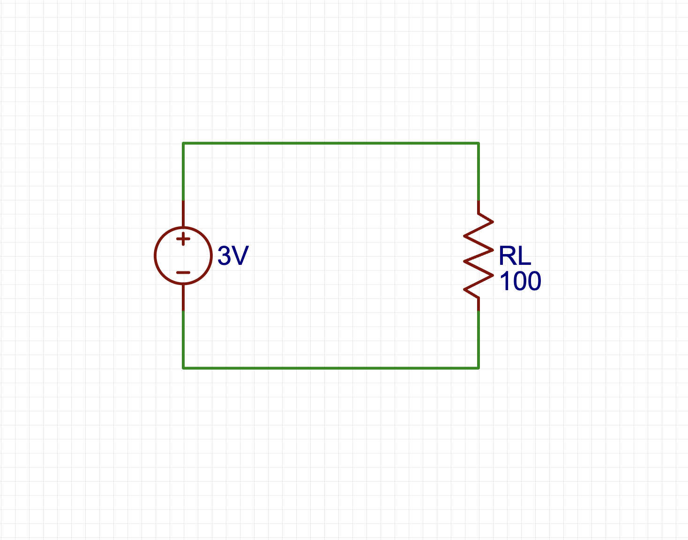
---

### Capacitors

A capacitor is two conductive plates separated by a thin insulating layer called a dielectric. 

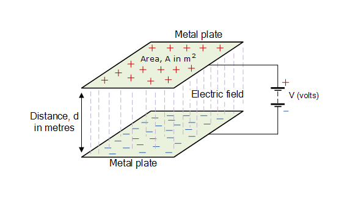

Applying a voltage across the plates accumulates charge on them, creating the same voltage difference across the plates. We refer to this process as "charging the capacitor."

The relationship between charge and voltage is as follows:
$$\large Q = C \cdot V$$
C is the capacitor's capacitance, which is a constant value measured in Farads. Capacitance measures the capacitor's ability to store charge; a higher capacitance means more charge can be stored. 

If we fully charge a capacitor and then disconnect the voltage source, the capacitor keeps its voltage, since the current has nowhere to flow.

If we then attach a load, the current now has somewhere to flow, so the capacitor discharges. 

Current through a capacitor follows

$$\large I = C \cdot\frac{dV}{dt}$$

which says a capacitor only draws or supplies current while the voltage across it is changing. At DC, a capacitor behaves like an open circuit. 

This principle is exactly why capacitors are used to smooth ripples and filter out noise. High frequency voltage spikes get shunted (shorted to ground) through the capacitor, while the slow, steady DC voltage passes by undisturbed. There are several types of capacitors with different strengths and drawbacks, which Part 2 gets into.

#### Combining capacitors

Capacitors combine the opposite way resistors do. In parallel, their capacitances add:

$$\large C_{eq} = C_1 + C_2 + ... + C_n$$

In series, they combine the way resistors do in parallel:

$$\large \frac{1}{C_{eq}} = \frac{1}{C_1} + \frac{1}{C_2} + ... + \frac{1}{C_n}$$

#### Reading Question 2

In the following RC circuit, the capacitor is charged fully by the 12V source. Then, the source is disconnected, and the capacitor discharges through the resistor. 

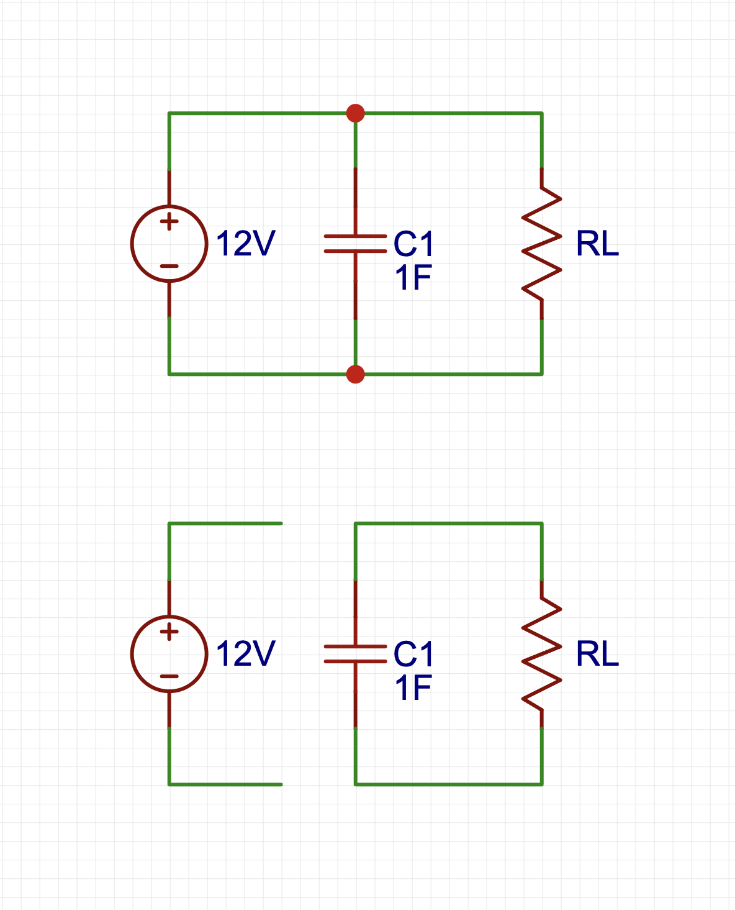

Real capacitors have an internal resistance (ESR), and they can be modeled as a resistor in series with the capacitor. 

If we substituted the $1F$ capacitor with two $0.5F$ capacitors in parallel, would the efficiency of the circuit increase or decrease? 

Use mathematical relationships to support your answer.

---

### Inductors

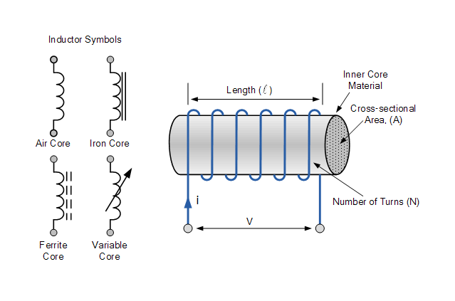

Inductors are the last of the three basic passive components. Physically, an inductor is just a coil of wire. Current through the coil generates a magnetic field, and that field stores energy the same way a capacitor's electric field does. In practice, an inductor behaves like the mirror image of a capacitor: where a capacitor resists changes in voltage, an inductor resists changes in current.

$$\large V = L\cdot\frac{dI}{dt}$$

where $L$ is the inductance, measured in Henries. An inductor will develop whatever voltage it takes to oppose a change in the current through it, which is also why abruptly interrupting current through an inductor produces a dangerous voltage spike.

#### Combining inductors

Inductors combine the same way resistors do. In series:

$$\large L_{eq} = L_1 + L_2 + ... + L_n$$

And in parallel:

$$\large \frac{1}{L_{eq}} = \frac{1}{L_1} + \frac{1}{L_2} + ... + \frac{1}{L_n}$$
---
### Diodes

Diodes are semiconductors that allow current to flow in one direction (forward) and block it in the other (reverse). In the forward direction, no meaningful current flows until the voltage across the diode passes a threshold called $V_t$, or $V_f$, the forward voltage. The real current-voltage relationship is exponential rather than a hard on/off switch, but treating $V_t$ as a fixed threshold, commonly around $0.7V$ for silicon, is a good enough approximation for most design work.

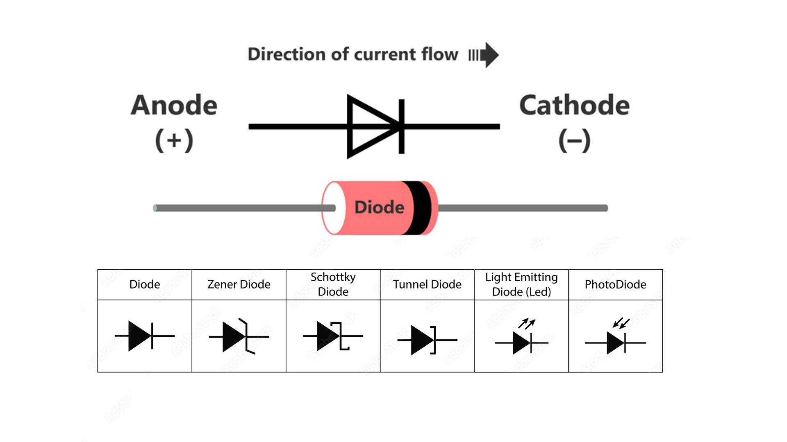

There are several types of diodes worth knowing about now, in more depth later.

**Zener diodes** have a reverse breakdown voltage $V_Z$ in addition to their forward voltage. In between the two regions, they block current like any other diode. You can think of them as a two-way diode with thresholds in both positive and negative voltages. That makes them useful for voltage regulation and clamping, and they still behave like a normal diode in the forward direction.

**Schottky diodes** have a lower forward voltage (typically $0.2V$ to $0.3V$ instead of $0.7V$) and much faster switching. Both of those cut power loss, which is why they show up in high-frequency switching circuits like buck converters.

**LEDs** (Light Emitting Diodes) emit light when forward current flows through them, with a $V_t$ that varies by color. They're often used as indicators for when a circuit is on. The brightness of an LED is approximately proportional to the current going through it.

#### Diodes in practice

In this circuit with a battery, a resistor, and a diode in series, assume $V_t = 0.7V$ and $R = 1k\Omega$.

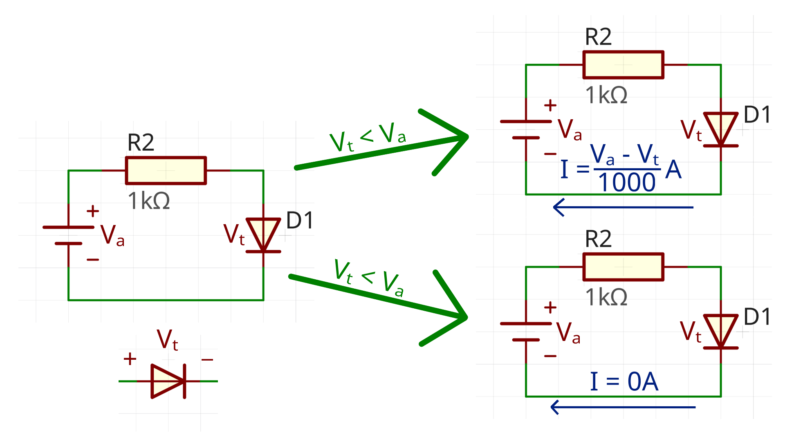

With a $0.5V$ source, no current flows at all, because the diode's threshold hasn't been met.

With a $3V$ source, the diode turns on and behaves like a fixed $0.7V$ drop. According to KVL, the voltage drop across the resistor is the voltage gain across the battery minus the drop across the diode: $3V - 0.7V = 2.3V$. To find the current through the resistor, Ohm's law gives us $I = 2.3V / 1k\Omega = 2.3mA$.

#### Reading Question 2

1. You want to use a $9V$ battery to drive a circuit that lights up a red LED. The LED has a forward voltage $V_f = 2V$ and you want to drive it at $20mA$. What value resistor do you put in series with it?

2. Assume you swapped your red LED with a blue LED that had a $V_f$ = $3.3V$. Given that the resistor and battery didn't change, would the LED shine brighter or dimmer and why?

## Part 3: Physical limitations of parts

In this next part, we will discuss the differences between ideal and real parts and the implications when you design real circuits.

### Real parts have limits

The equations we introduced in Parts 1 and 2 describe ideal circuit elements. A major difference between ideal vs. real parts is that real parts only follow those models inside their rated limits, and outside them they act unreliably and fail.

Passive elements are limited by maximum voltage and current values:

- Resistors have a power rating ($I^2R$), and exceeding it can cause overheating. 
- Capacitors have a maximum voltage, and exceeding it breaks down the dielectric, usually shorting the part. 
- Inductors have a saturation current $I_{sat}$, past which its magnetic field cannot increase further and the inductance often collapses. 

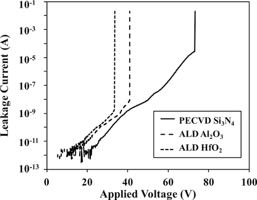

Because of all this, you must practice the principle of **derating**, which is just a fancy way to say, "design well below a part's absolute maximum rather than up against it." A common starting point is to pick capacitors rated for at least twice the working voltage and run resistors at half their power rating or less in steady state. The absolute maximum ratings table in a datasheet describes where the part is destroyed, not where you should aim. Even when approaching these maximum values, performance may already be heavily impacted. 

Real parts also carry parasitics (tiny resistive, capacitive, or inductive losses) that the ideal model ignores:

- Capacitors commonly have **ESR** (Equivalent Series Resistance), which is a resistive loss that is inversely proportional frequency. 
- Inductors have **DCR**, the plain DC resistance of the wire in the coil. 
- Every part has a **tolerance**, or a range of values provided by the manufacturer: a $10k\Omega$ resistor at 5% tolerance is anywhere from $9.5k\Omega$ to $10.5k\Omega$.

We will discuss how to design around these limitations later in this document.

Finally, watch polarity. Diodes will break at large reverse-bias voltages, and electrolytic capacitors even at small reverse voltages. 

---
### Symbols, packages, and footprints

Let's go over some common terminology for the different attributes of a part:

- The **symbol** is the schematic figure/drawing and is often generic. There are sometimes variations in symbols (i.e. capacitors with/without polarity) but they are more or less generic.

- The **package** is the physical body: its size, shape, and pin arrangement. For example, the same chip can come in different packages. 

- The **footprint** is the copper land pattern on the board that that directly corresponds to the shape of the package.

One symbol maps to many packages, so pick the package deliberately (can you hand-solder it? are you paying for assembly?) and then confirm the footprint matches the land pattern drawing in the datasheet. If pad pitch, hole diameter, or annular ring don't match, the part either won't fit or won't solder reliably, and you won't find out until it's too late.

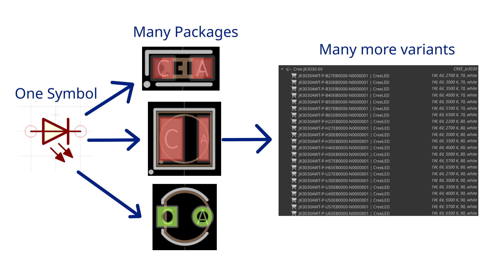

Packages come in two broad families. **Through-hole (THT)** parts have leads that pass through drilled holes and solder on the far side; they're easy to hand-solder but eat a lot of board area. **Surface-mount (SMD)** parts sit on pads on the surface. They're much smaller (0402, 0603, and 0805 refer to body size in hundredths of an inch), cheaper at volume, and progressively harder to hand-solder as they shrink. 

**Integrated circuits** pack an entire designed and tested circuit into one package. They save you enormous amounts of work, at the cost of having to design around the manufacturer's operating parameters and read their documentation carefully. We will be closely following an IC's datasheet for the design portion of this week's training.

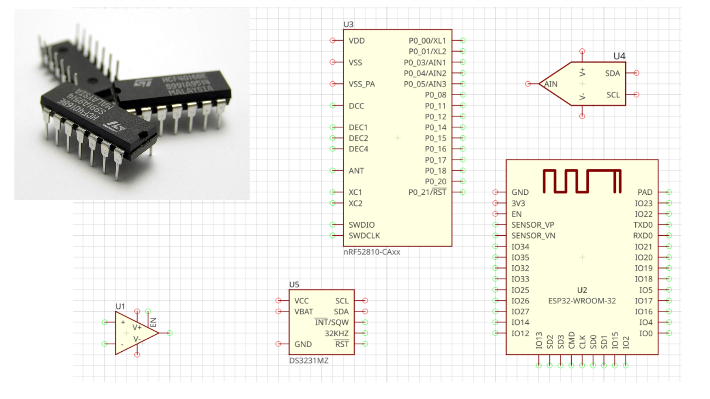

---

### Reading a datasheet

Datasheets are the most important documents in PCB design, and you should never read one cover to cover. Use the table of contents as an index and open only the sections you need:

- **Pin configuration and pin functions** tells you what each pin does and what to connect it to (other pins, power, or external components)
- **Recommended operating conditions** gives the voltage, current, and temperature ranges the part is designed for. Remember to derate!
- **Electrical characteristics** gives typical, minimum, and maximum values for things like threshold currents and output drive.
- **Application circuits** are reference circuits that can often be directly copied into your schematic.
- **Package and mechanical** gives a detailed report of body dimensions, pin pitch, and the land pattern your footprint must match.
- **Layout recommendations** cover decoupling placement and any pins that need special routing care. They are very important when making board-level decisions and can make or break your circuit.

---

### Schematic and layout

A schematic is the logical diagram of a circuit and only specifies electrical connections. It does not give any information on where or how those connections are made.

Let's go over some common terminology for schematics:

- A net is simply a node and represents a contiguous electrical connection. They are identified by a unique name (net label).
- Power symbols like VCC/VDD and GND/VSS are also nets.
- Each part is accompanied by a reference designator with the abbreviation for the part and a number (e.g. R1, C2, L1). 

---
WIP
---

#### A small worked example

Before the LM555, it helps to see the whole loop on something simple. This is a dupont splitter: one input connector routed through a fuse and a switch out to five outputs. Here's the schematic,

and here's the same design as a board, plus a 3D render of it:

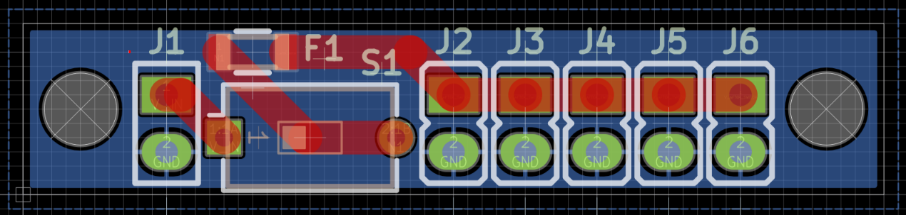

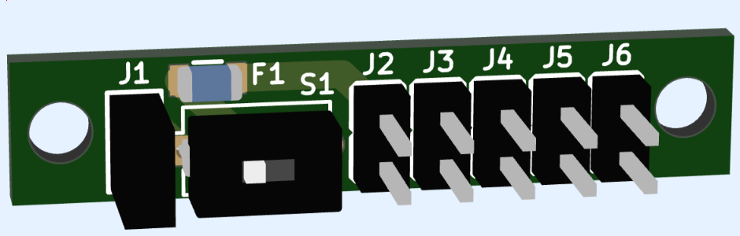

That's the entire workflow in miniature. The project walks through the same sequence in EasyEDA with the 555 blinker.

### Power, ground, and return paths

Current always flows in a closed loop: out of the source, through the load, and back through a return path. The ground symbol on a schematic isn't a magic zero-impedance sink, it's just a label for the common return net, and on the board that net is copper like everything else.

Where that return current flows depends on frequency. At DC it takes the path of least resistance. At higher frequencies it takes the path of least impedance, which usually means running directly underneath the signal trace on the adjacent layer. That's a useful thing to know even on simple boards: if a signal on the top layer has no return path near it, the loop it forms is large, and large loops both radiate noise and pick it up.

On a two-layer board, keep return traces short and route signals alongside their returns. Filling the bottom layer with a **ground pour** lowers return impedance for free and is worth doing even on a design as simple as the blinker.

**Decoupling capacitors** sit between $V_{CC}$ and ground, physically next to an IC's power pins. They work as a local charge reservoir: when the IC suddenly draws a spike of current, the nearby cap supplies it instead of that transient being pulled through a long power trace. That keeps the current loop short and the supply quiet. Typical values are $0.01\mu F$ to $0.1\mu F$ ceramic for high-frequency bypass, sometimes paired with a larger electrolytic for bulk storage.

Which brings up the difference between the two:

- **Ceramic** caps (X7R or X5R dielectric) have low ESR, are small, and aren't polarized, which makes them the right choice next to IC power pins. Avoid Y5V and Z5U dielectrics, where the effective capacitance collapses under bias and temperature.
- **Electrolytic and tantalum** caps offer much higher capacitance in exchange for polarity and higher ESR. Use them for bulk energy storage, input filtering, and timing caps in the µF range, and watch which way around they go.

Putting several small ceramics in parallel lowers the effective ESR, since parallel capacitances add while parallel ESRs combine like resistors in parallel.

For inductors, when you use them: ferrite cores for switching supplies, derate $I_{sat}$ to 70–80% of the rated value, and prefer shielded parts near sensitive analog or sensor traces so their magnetic field doesn't couple into anything.

### Impedance on a real board

Part 1 introduced impedance as $Z = R + jX$. On a PCB there are three regimes worth telling apart.

At **DC and low frequency**, traces are basically resistors, and the only thing that matters is IR drop: shorter and wider means lower resistance. The 555 blinker at 1 Hz lives entirely here.

At **moderate frequency**, trace inductance and capacitance stop being negligible. Every trace has loop inductance, and traces running near each other have mutual capacitance. Note that this is about edge speed, not clock rate; a slow clock with fast edges still contains high-frequency content.

At **high speed**, traces have to be designed as transmission lines with a target characteristic impedance $Z_0$:

$$\large Z_0 = \sqrt{\frac{L}{C}}$$

For a microstrip, meaning a signal trace running over a ground plane, $Z_0$ is set by trace width, dielectric thickness, and copper weight. Get it wrong and signals reflect off the mismatch. USB, Ethernet, and DDR all require controlled impedance, usually $50\Omega$ single-ended or $100\Omega$ differential. You won't need any of this for the blinker, but you will on later boards.

### Coupling and EMI

Two nets that run parallel and close together form a capacitor, so a voltage change on the **aggressor** net pushes current into the **victim** net. This capacitive coupling gets worse with closer spacing, longer parallel runs, and faster $dv/dt$ on the aggressor. You fix it by increasing spacing, shortening the parallel run, routing sensitive analog with a ground plane between layers, or dropping a grounded guard trace between the two.

The magnetic version works the same way. Current in one trace creates a magnetic field that induces a voltage in any nearby loop, and it gets worse with larger loop area on the victim, faster $di/dt$ on the aggressor, and closer spacing. The fixes are to minimize loop area by routing every signal next to its return, keep high $di/dt$ paths like switching regulators and motor drivers away from sensitive inputs, and use shielded inductors when you can't avoid the field.

Both of these are also how a board interacts with the world outside it. **Emission** is your board radiating, which happens when large loops carry changing current and the loop acts as an antenna; long stubs, unterminated traces, and poor return paths are the usual culprits. **Susceptibility** is the reverse, where high-impedance unshielded inputs pick up external fields.

None of this is a practical concern for a 555 running at 1 Hz. The physics still applies, but the reason to build the habits now (short returns, decoupling at the IC, no gratuitous loop area) is that they carry over unchanged to boards where it does matter.

### Routing

Routing isn't just connecting up ratsnest lines. The shape of a trace affects how manufacturable it is, what its impedance looks like, and how much it couples into its neighbors.

**90° bends** are traditionally discouraged, partly because the inside corner can form an acid trap where etchant pools during fabrication, and partly because of a small impedance discontinuity. At low speeds they're usually fine, but 45° chamfers or rounded corners are the safer default and cost you nothing. For the same fabrication reason, avoid **acute angles and narrow copper slivers** between closely spaced features, since thin slivers can peel or flake off during etching.

When unrelated signals have to share a region, don't run them side by side for long distances if you can help it. Crossing at a right angle or hopping to the other layer through a via couples far less than a long parallel run. A ground pour on the adjacent layer helps here too.

**Vias** are cheap but not free. Each one adds inductance and a drilling step, so for power and ground it's better to keep the path on one layer when you can, and save via hops for when routing density genuinely demands them.

**Trace width** serves two masters. It sets current capacity, since wider traces run cooler, and on controlled-impedance nets it sets $Z_0$ together with spacing. For signal nets carrying milliamps, like anything on the 555 board, the default width is fine. For power rails carrying amps, calculate it.

### Trace width, clearance, and design rules

The rules you set in a DRC dialog come from two places: **IPC standards**, which is what fabricators and CAD tools implement, and your specific **fabricator's capability sheet**. (IEEE publishes broader EMC and documentation guidance, but it isn't where trace width numbers come from.)

For current capacity, trace heating follows $P = I^2 R_{trace}$, and **IPC-2152** provides the charts that turn a target current, copper weight, temperature rise, and layer into a width. As rough guidance for 1 oz outer copper:

- Below **100 mA**, the default width (often 0.254 mm, or 10 mil) is plenty.
- Between **100 mA and 1 A**, look it up or calculate it, and err wide.
- Above **1 A**, use IPC-2152 or your fab's calculator, and consider heavier copper or a plane instead of a trace.

Part 1's rule about widening traces past ~0.1 A is the same idea in plainer language.

For clearance, **IPC-2221** sets minimum spacing between conductors based on the voltage difference between them and the pollution environment. At the 9 V the blinker runs on, generic fab minimums (typically 0.15–0.2 mm, or 6–8 mil) already give you enormous margin. Clearance becomes something you have to look up when you start designing at mains voltage or on high-voltage buses.

The rules DRC actually enforces are mostly manufacturing limits:

| Rule                        | Why it exists                                     |
| --------------------------- | ------------------------------------------------- |
| Minimum trace width         | Etch resolution and current capacity              |
| Minimum spacing (clearance) | Prevents shorts, reduces crosstalk                |
| Minimum annular ring        | Reliable connection between pad and hole          |
| Minimum drill size          | Physical limit of the fab's drills                |
| Copper-to-board-edge        | Stops copper peeling when the board is routed out |

Set these to match the fabricator you're actually ordering from (JLCPCB's 5/5 mil or 6/6 mil process, for example) before you finalize a layout, not after. The project uses 0.254 mm traces, comfortably above any typical minimum and more than enough for the current this circuit draws.

### From layout to a real board

A finished layout exports as **Gerber files**, one per layer (copper, soldermask, silkscreen) plus a drill file, and that's what the fab builds from. Most EDA tools can also order directly.

It's worth repeating that a clean DRC is not a working circuit. DRC only confirms the board can be built. You still need to review the schematic for correct values and fully connected pins, visually inspect the layout for polarity marks and footprint orientation, and then bring the board up carefully once it arrives: power first, then verify one block at a time.

The failures that get first boards are usually mundane:

- A polarized cap or LED placed backwards
- A footprint that doesn't match the part actually ordered
- Missing decoupling, or a reset pin tied the wrong way
- A schematic net that never got routed in copper

### Reading Question 3

Two traces run parallel for 30 mm, 0.2 mm apart. Trace A switches from 0 V to 5 V in 10 ns. Trace B is a quiet analog sense line.

a.) Name one capacitive and one inductive mechanism by which Trace A could disturb Trace B.

b.) The 555's output switches at roughly 1 Hz with rise times in the microsecond range. Would you expect this coupling to matter on that board? Why or why not?

c.) A power trace carries 500 mA continuously on 1 oz outer copper. Is 0.254 mm (10 mil) likely to be enough, or should you go look at IPC-2152? Explain your reasoning.

### Before you open EasyEDA

You should be able to answer all of these without looking anything up: Why do you derate a part instead of designing to its maximum rating? What does a schematic capture that a layout doesn't, and vice versa? Where does the return current for a given signal actually flow, and why does that put the decoupling cap right next to the IC? What three things make crosstalk worse? When do you widen a trace for current, and when do you widen spacing for voltage? And what does passing DRC actually prove?

If those all have answers, continue to [PCB Design - Project](PCB%20Design%20-%20Project.md) and build the LM555 blinker.

## What's a PCB?

A PCB (Printed Circuit Board) is a permanent, machine-fabricated version of a circuit. Think of a breadboard, except with permanent connections (copper traces) and permanent components (soldered to the board). 

A PCB contains etched copper layers that connect components electrically as well as dielectric material (commonly fiberglass) that serve as insulators. 

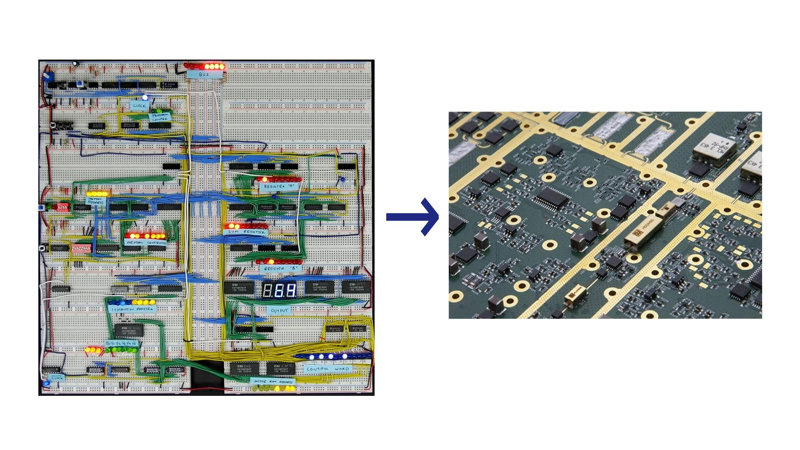

In TR, we'll mostly be designing **two-layer boards** - however, boards with more than 2 layers are often used in more advanced applications. A board's stackup tells us the ordered arrangement of conductive copper and insulated dielectric layers of a PCB. A typical 2-layer PCB stackup looks like this: 

| Layer         | What it does                                 |
| ------------- | -------------------------------------------- |
| Top silkscreen    | Printed labels               |
| Top soldermask    | Protective layer against shorts and bridges      |
| Top copper    |   Conductive layer for routing components |
| Core    | Dielectric nonconductive material that holds the PCB together |
| Bottom copper    |   Same as top  |
| Bottom soldermask    | Same as top      |
| Bottom silkscreen    | Same as top               |

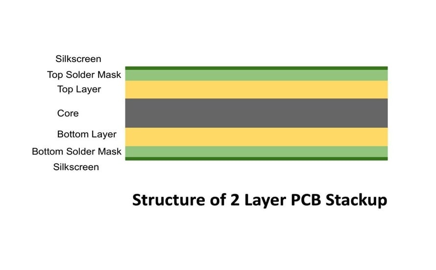

Copper thickness is specified by weight, in ounces per square foot. 1 oz copper is typical for most of our boards, but high-power boards often require 2 oz copper, which is capable of carrying more current for the same temperature. We'll talk about these design considerations later in the document.

### Routing a PCB

During board design, you'll have a few methods of connecting components:

- **Pads** are exposed copper areas where a component's pins are soldered down.
- **Traces** are the narrow copper paths connecting pads underneath the solder mask. 
- **Vias** are plated vertical holes that connect one layer to another. 
- **Copper pours** (or planes) are large filled regions of copper, often used for a low-impedence ground return path.

### The design workflow

Once you've determined what a board *needs to do*, the process is always the same three steps:

1. **Select parts.** Real components with real datasheets, packages, and ratings, not idealized values.
2. **Draw the schematic.** The logical connections between symbols. Nothing physical yet.
3. **Lay out the board.** Place footprints, route copper, check it against the fab's rules, and export manufacturing files.

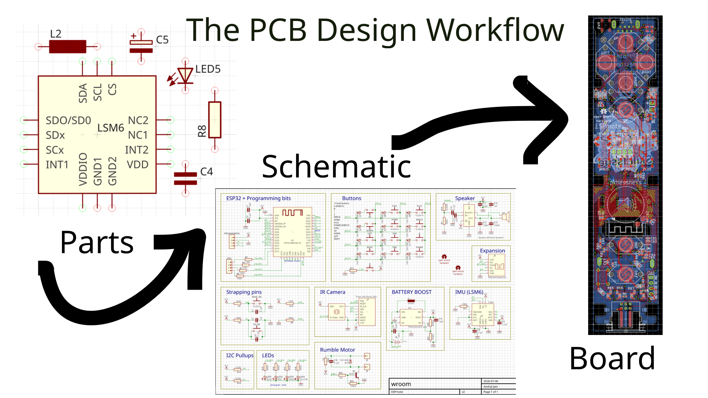

The schematic only says *what connects to what*. Below is a fairly involved one for an ESP32 breakout with an IMU, buttons, and a battery charger, but it's still just connectivity on paper. Nothing in it tells you where anything sits.

The layout is where that same circuit gets a physical shape:

Before you can lay anything out, though, you need to know what it is you're connecting. That's Part 1.
