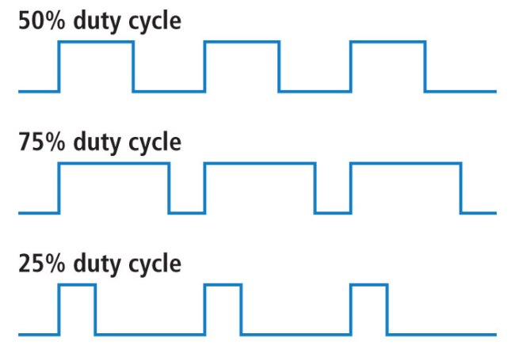
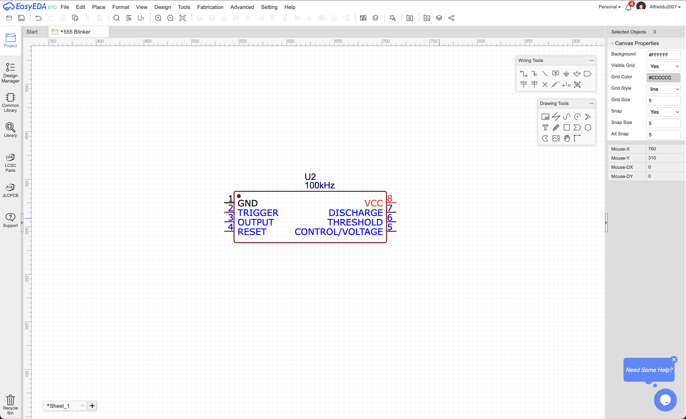
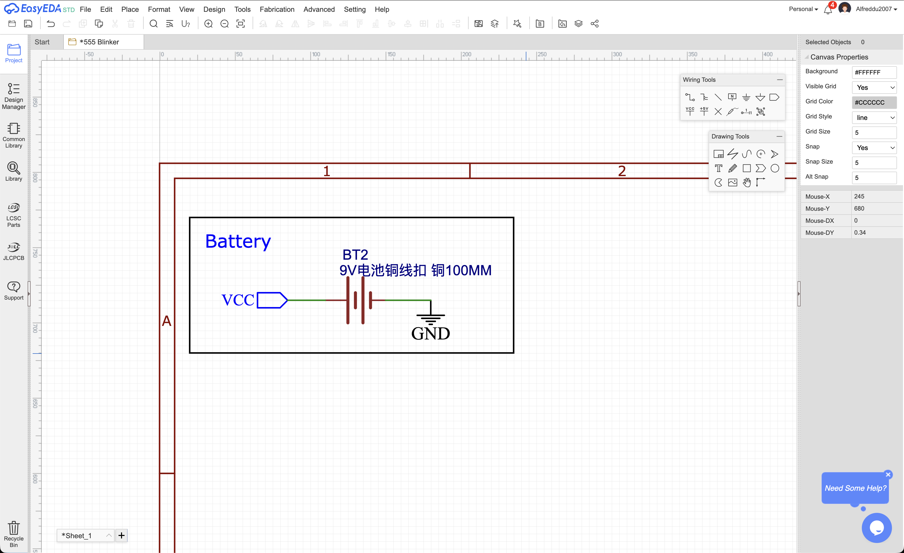
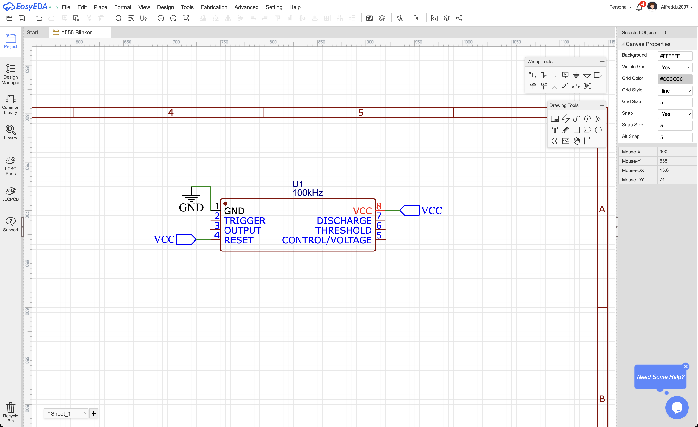
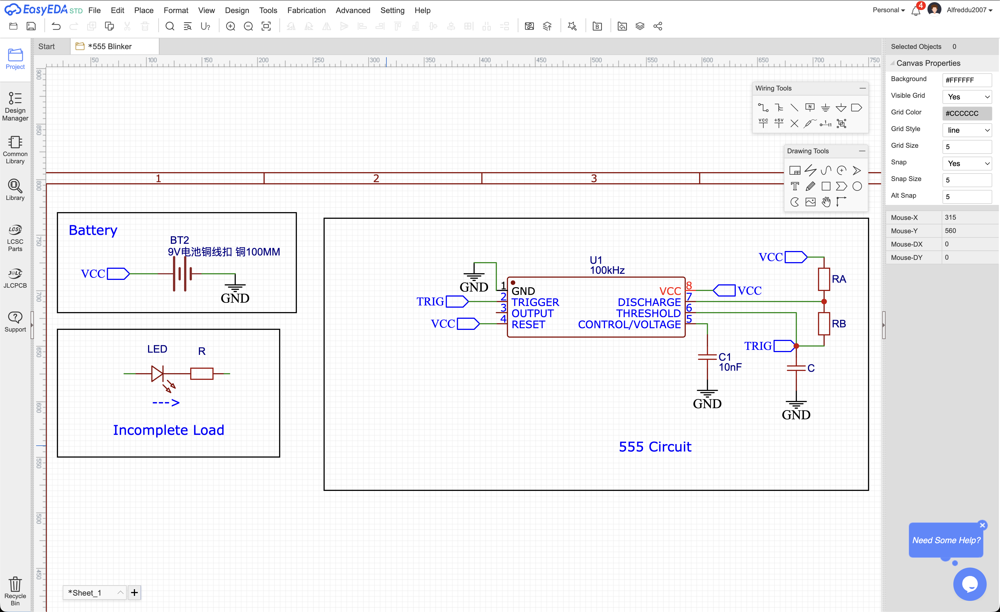
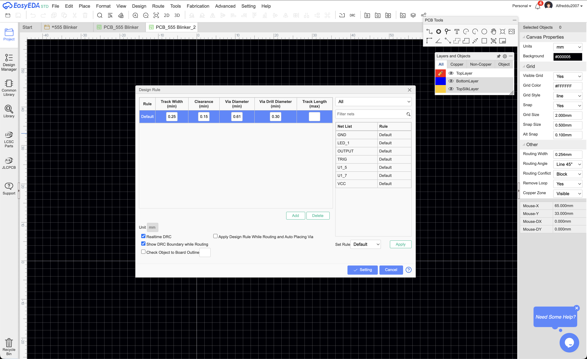
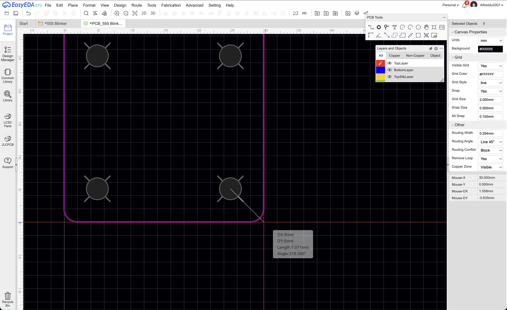
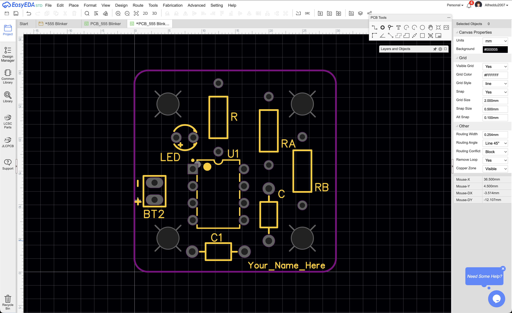
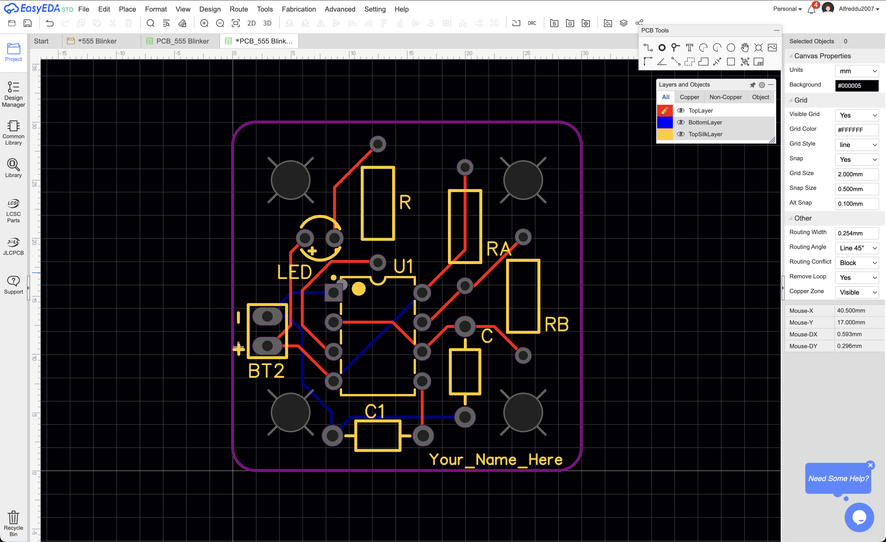

# PCB Design - Project

**Prerequisite:** complete [PCB Design - Concepts](PCB%20Design%20-%20Concepts.md) (Part 1 and Part 2) before starting this walkthrough.

Now that you've been introduced to the foundational concepts behind circuits, this document will help you apply these concepts by taking a real chip and turning it into a working, manufacturable board.

By the end of this activity, you'll be able to read and interpret datasheets, build schematics, source real parts, and lay out a fully routed PCB.

### Goal

Design a circuit that blinks an LED using an LM555 timer integrated circuit (IC), with these specifications:

- $1Hz$ frequency (the LED blinks once per second)
- $33.3\%$ duty cycle
- 9V battery supply

### The LM555

The 555 timer is a small, cheap, general-purpose IC that can generate precise timing pulses or oscillate continuously. It uses two external resistors (often called feedback resistors) and a capacitor to set the timing. 

It has three basic modes of operation: Monostable, Astable, and Bistable. We will only be focusing on the Astable mode of operation for this assignment, since we want a continuously blinking LED.

The datasheet for the specific part we're using, the Texas Instruments LM555, can be found here: [lm555.pdf](lm555.pdf)

## Exploring the datasheet

Don't read the datasheet from cover to cover! A lot of the information will not be useful to us. Instead, here are the sections you typically want to look at when designing a PCB:

- Schematics/wiring diagrams
- Pinouts (pin mapping)
- Output equations
- PCB layout suggestions

First, find the following sections:

- Section 5 — Pinout
- Section 7.4.2 — typical application in Astable mode

### The pinout

An IC's pinout identifies each pin's purpose and location. Pins are always numbered counterclockwise, starting from the top left. From **Pin Configuration and Functions** on page 3 we can find a diagram of the IC:

You can ignore the internal circuitry of the chip, since this is not important to us. Next, briefly read the **Pin Functions** table which gives us more detail. Try to make sense of each pin's purpose.

This table gives us a good idea of each pin's purpose. It will be helpful in conjunction with the example schematic in Astable mode.

### The output graph

Next, we'll jump around a bit. Let's inspect the output waveform of the circuit (output is Pin 3, according to the pinout). Scroll to **Device Functional Modes (continued)** on page 11:

The top trace on the graph is the output voltage, and we can see that for a $V_{CC} = 5V$ input, we get a square wave output that is $V_{CC}$ when HIGH and $0V$ when LOW.

### The Astable application circuit

Now, check **7.4.2 Astable Operation** on page 10:

Don't worry if this schematic looks scary right now! We'll break it down into manageable parts during design. 

First, take a look at the left hand side of the diagram. There 
are two $R_L$ (shorthand for $R_{Load}$) symbols - $R_L$ is commonly used to represent any generic load we attach to the circuit. For this project, our load will be an LED (and current limiting resistor in series with it). 

You may be asking why there are two $R_L$ symbols with dashed lines when we only have one load. This is to show that we actually have two possible places we're allowed connect a load to the 555 circuit:

1. We can place it between pin 8 ($V_{CC}$) and pin 3 (output). When output goes HIGH, the voltage on both ends = $V_{CC}$, so there is no voltage across our load and our LED turns off. When output goes LOW, the voltage across our load = $V_{CC}$ and the LED turns on.
2. We can place it between pin 3 and GND. When output goes HIGH, the voltage across our load = $V_{CC}$ and the LED turns on. When output goes LOW, both ends = $0V$ and the LED turns off.

It's important to understand this concept, since only one configuration will allow us to meet the circuit specifications (we'll see why soon).

### The transfer equations

Next, let's take a look at the equations below:

These tell us that we can tune the IC's output waveform to match our specs ($1Hz$ and $\large\frac{1}{3}$ duty cycle) by selecting values for $R_A, R_B,$ and $C$. Let's use the equations for total period and duty cycle to select the values for our components.

### Quick tips for component values

As a side note, in most circuit design problems like this, there are many theoretical solutions. In other words, there are infinitely many ways to choose $R_A, R_B,$ and $C$ in order to achieve our desired period/duty. However, we are limited by real component values.

For example, it would be really hard to find a $10F$ capacitor, and that would also force our resistor values to be super small. We want to aim for standard values that land somewhere in the middle of the spectrum for each component.

For resistors $R_A$ and $R_B$, we want to choose something in the $k\Omega$ range at a standard value (e.g. $1k, 47k, 100k$). This prevents the IC from drawing too much current. For capacitors, we want to choose small values in the $pF$ to $\mu F$ range, since this is the range of ceramic capacitors.

### Calculating duty

Now, we're ready to solve the problem! First, let's try to derive a relationship between the target duty cycle of our LED and our unknown variables. 

A signal's duty cycle or simply duty is the ratio of the time when it's ON over the total time. Assuming the signal is periodic, the same relationship holds for one cycle:

Go back to equation 5, where we are given $D = \Large\frac{R_B}{R_A + 2R_B}$. Notice that the equation for $D$ was derived by dividing the output LOW discharge time $\large t_2$ by the total discharge time $\large t_1 + t_2$. In other words, $D$ represents the percentage of the time that output is LOW in a single cycle. Since we want our load to be driven HIGH for $\Large \frac{1}{3}$ of the period, let's try making $D$ to equal $\Large\frac{2}{3}$.

$$\large \frac{2}{3} = \frac{R_B}{R_A + 2R_B}$$
 Do you notice an issue?

No matter how we select $R_A$ and $R_B$, the highest $D$ value we can achieve is $0.5$. Intuitively, this means the output will always be driven HIGH at least $50\%$ of the time. 

Luckily, we have one piece of information that we haven't yet used. If we go back to the schematic, it shows us that we have two options for where to place our load. To drive our load with a duty of $33\%$, we need to do the following steps:

- Step 1: Determine the load configuration such that when output is LOW, the load is driven HIGH.
- Step 2: Find $R_A$ and $R_B$ such that output is HIGH $66\%$ of the time

### Finding component values — feedback components

Now, it's your turn! 

- First, figure out which load configuration we should choose (Step 1). 
- Next, you should be able to derive a value for $D$. Then, using the standard resistor value $R_A$ = $47k \Omega$, calculate the corresponding value for $R_B$ (Step 2).
- Lastly, you should be able to derive a value for $C$. If you did your calculations correctly, $C$ will be in the $\mu F$ range. Round $C$ to the nearest $\mu F$ - you should get a clean value. 

### Finding component values — LED circuit

Next, let's find component values for our load, which will consist of an LED and a resistor. Since an LED has a very low internal resistance, connecting it directly to HIGH will cause it to draw too much current and burn out instantly. Because of this, we have to use a current limiting resistor in series with the LED as our load.

An LED is typically bright enough at $20mA$. Knowing the voltage of HIGH and assuming the LED's forward voltage $V_f = 2V$, what resistor value $R$ should you choose?

Your answer should fall in the $\Omega$ range. Some standard resistor values for this range are 100 $\Omega$, 150 $\Omega$, 220 $\Omega$, 330 $\Omega$, 470 $\Omega$, and 680 $\Omega$. Pick the value that is closest to your calculated $R$.

### Summary of components

- $R_A$ & $R_B$ — feedback resistors
- $C$ — capacitor between pin 6 and ground
- $R$ — current limiting resistor for the LED
- $0.01 \mu F$ capacitor between pin 5 and ground
- $9V$ battery
- LM555 IC
- Red LED

## Designing the Schematic 

### Create the EasyEDA project

First, open EasyEDA and create a new project named `LM555 Blinker`.

### Import the LM555 into EasyEDA

First, we'll import the LM555 into our project. 

1. Navigate to [LCSC.com](LCSC.com): LCSC is EasyEDA's part library.
2. Use the parts search bar and search "LM555" and click "Programmable Timers and Oscillators." Check "TI" under manufacturer. 
3. Scroll down until you see "TI LM555CN/NOPB," then copy the Part # (starts with a C.) The LM555CN is the PDIP-8 package for the LM555. When designing PCBs, be sure to pick the appropriate packages for your PCB.
4. In EasyEDA, go to `Place > Symbol`, paste the part number, and double click on the result to place it into your schematic.

You should end up with a blank sheet and a single U1 symbol showing all 8 pins like above.

### Place/wire the power supply

Before wiring the timing network, let's wire power, which is often simpler. This project is powered by a simple 9V battery pack, so find an appropriate part on LCSC.

Note that when searching for parts, you want to take advantage of filters to narrow down your search and avoid parts without symbols/footprints. Place the part into your schematic like with the LM555.

Rather than drawing a wire all the way from the battery to the IC (which gets unreadable fast once a schematic has more than a couple of parts), give each battery terminal a net label instead. 

Under `Wiring Tools` select the pentagonal shape to insert a net and press `R` to rotate as needed. To the positive terminal, connect a net renamed to `VCC`. To the negative terminal, connect the ground symbol. 

Any pin anywhere on the sheet with the same net label is electrically the same node, EasyEDA doesn't care how far apart they are drawn.

Once it's wired, let's box the battery section off and label it "Battery Supply". This is a habit worth building early, since a schematic that's easy to read is a schematic that's easy to debug and explain.

Now go back to U1. Following the astable mode schematic, wire the pins that connect straight to power: pin 1 (GND) to `GND`, pin 8 ($V_{CC}$) to the `VCC` net, and pin 4 (RESET) also to `VCC`, since we're not using the reset function and the datasheet says to tie it high when unused. 

## Import the passive elements

Now, this is when you'd go pick real resistors and capacitors matching what you calculated in Step 2, by browsing a supplier like LCSC and checking package, tolerance, and voltage rating until you land on a part number for each. The most comprehensive method of filtering down passive components is to use the catalog drop-down menu and navigate to Passives. 

Explore the filters and import all your parts. **Use only through-hole parts for this step.**

### Finish wiring the astable network and load

With power finished, build the rest of the astable schematic. Working through each signal pin one at a time (rather than trying to wire the whole thing at once) makes the wiring process much easier to keep track of.  

For the load resistor and LED, remember to use the configuration you chose earlier. The order which the LED and resistor go doesn't matter, but make sure to respect the LED's polarity. 

Once you're done, box and label any circuit sections you've separated and fill out the frame. For the name, use the convention `Project_Name_VER#`.

At this point you have a complete and functional schematic. Go to `Design > Convert Schematic to PCB`. If you connected every node, you should be transported to the PCB design page. Next, let's design our PCB!

## Designing the PCB

### From schematic to PCB

Now on the PCB design tab, you should greeted with a board outline manager, where you must first define the board dimensions. Here, set the type to Round Rectangular and give yourself a generous amount of board space like $50mm$ x $50mm$ (you can shrink it later). 

A small quirk about EasyEDA: The canvas's "origin" is always top-left corner of your board, so the board setup can be a bit unintuitive. Since we want our board to be in the first quadrant, your Start X should always be 0, but your Start Y should equal your board Height. Here is an example:

Note that you can always change your board dimensions by navigating to `Tools > Set Board Outline`.

### Setting up your environment

There are a few environmental parameters you want to set up before anything else. First, select the canvas background and make sure the units are in milimeters under `Canvas Properties`. Also, feel free to change the grid and snap sizes; I'm using $0.5mm$ as the snap size and $0.1mm$ as the alt snap (for more precise placements).

Next, we'll briefly review the design rules. The design rules are simply a list of specifications for routing and placement that are checked whenever you run the design rule check. These options can be found under `Design`. For our board, we can use the default rules since our circuit is quite simple and doesn't draw much current. For power PCBs, setting adequate trace widths and clearances is imperative.    

### Add mounting holes

For TR boards, you'll want to add mounting holes to every corner so the board can be screwed into an enclosure. The standard convention is to design for M3 screws by using $3.3mm$ holes $5mm$ away from each corner. To place a hole, click the hole tool under `PCB Tools` and use the ruler tool to ensure correct spacing. You can also experiment with right clicking the object and using `Offset`. Repeat for all corners.

### Place footprints and route the board

With an outline defined, it's time to arrange the footprints inside it. A few things worth thinking about while placing parts:

- Keep $C_{bypass}$ (the $0.01\mu F$) physically close to U1's $V_{CC}$ pin. Bypass capacitors filter noise and quickly become ineffective when placed too far away from the target pin.
- Give the battery holder (BT1) and the LED room near the board edge, since both are likely to be user-facing or need to be accessible once the board is in an enclosure.
- Leave enough spacing between parts that traces have room to route without crossing (on a 2-layer board, a trace can hop to the bottom layer to avoid a collision, but it's still easier to avoid the problem in placement than to fix it in routing).

Once placement looks reasonable, route a trace along every remaining ratsnest line until none are left. To do this, switch to a copper layer  (either Top or Bottom) under `Layers and Objects` and press `W`. Remember to use good design practices (see the Concepts document). 

### What's Next

You're almost done with this week's training!
You now have a finished, routed PCB that meets both specs on paper and is ready to send to a fab. 

From here, first use the text tool to write your name on the silkscreen layer. Then, run a final DRC and save a screenshot of the passing screen. 

Hypothetically, if you wanted to fabricate your board, you'd want to generate manufacturing files at this point. 

To do this, you need to export your board as a few different files. On the top toolbar, right of DRC, you'll see three folders:
- BOM: stands for Bill of Materials and provides manufacturers with a list of all the parts your board uses.
- Gerber and Drill file: Describes the bare PCB in full (traces, pads, vias, silkscreen, dimension, etc). Does not include components.
- Pick and place file: Tells the manufacturer where to place your parts on the board (if you choose to order assembly).

In the PCB ordering process, you'll be able to choose which parts on the board you'd like the manufacturer to assemble for you. You also have the option to do the assembly completely by yourself. To save money, we prefer to order parts separately and assemble our boards in-garage.

### Submission

To complete this week's training, submit the following to [this google form:](x)

- Screenshot containing passing DRC with your PCB and name on the silkscreen
- Answers to the reading questions in PCB Design - Concepts  
