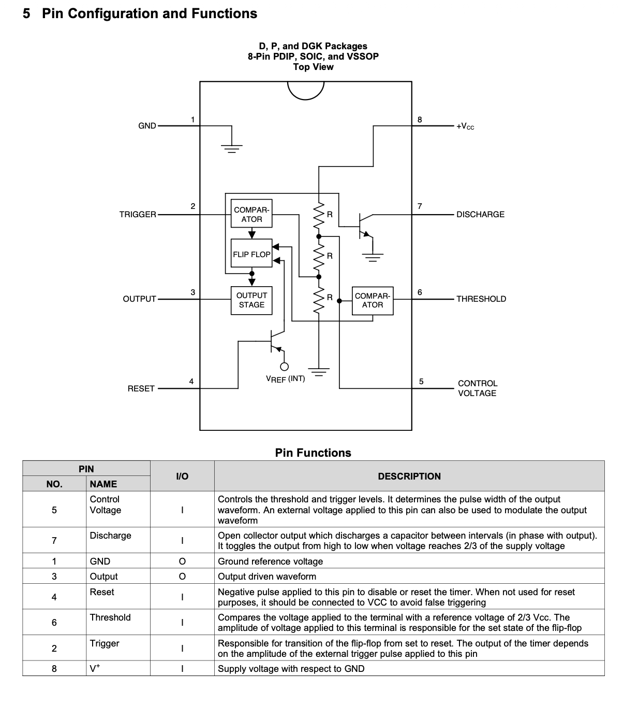
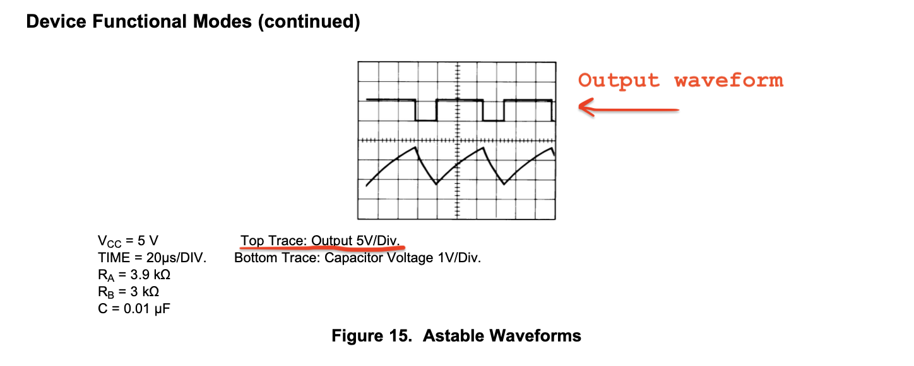
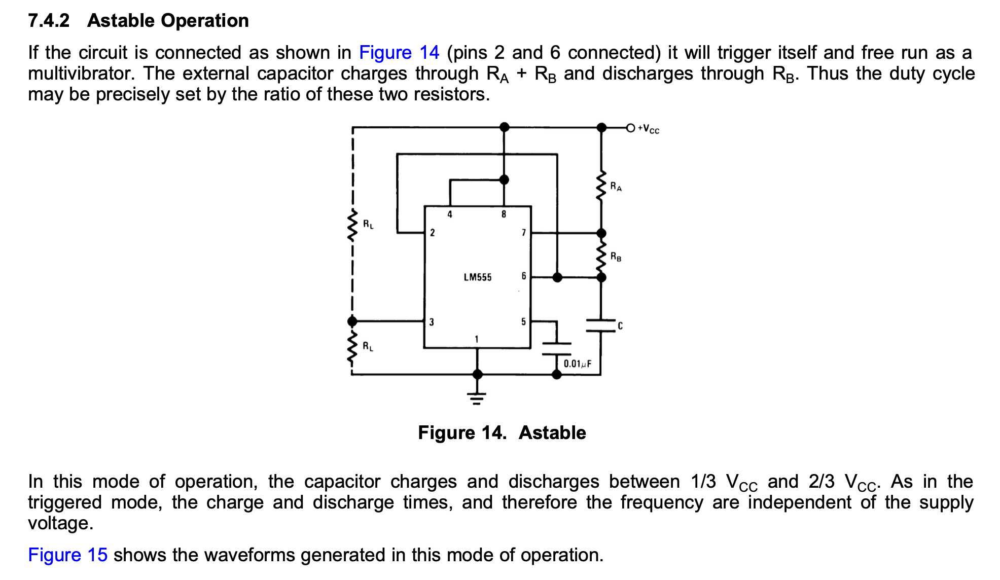
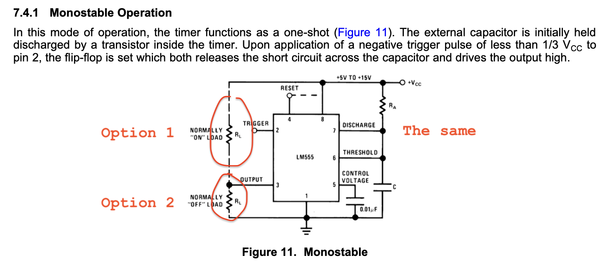
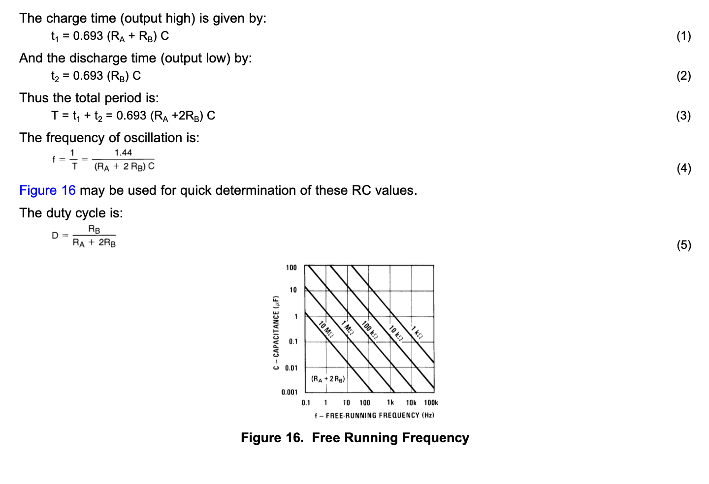
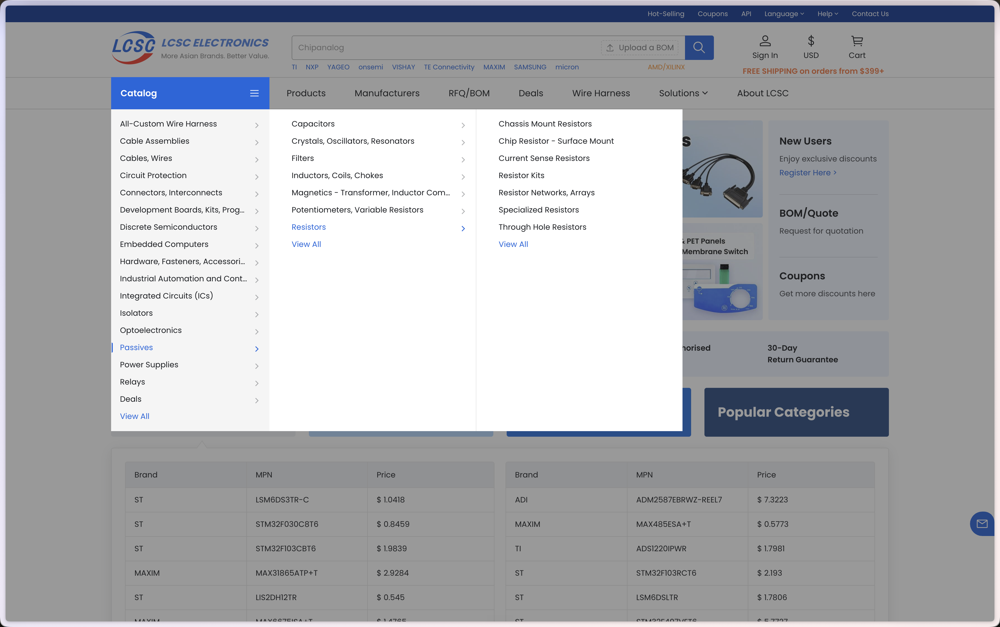
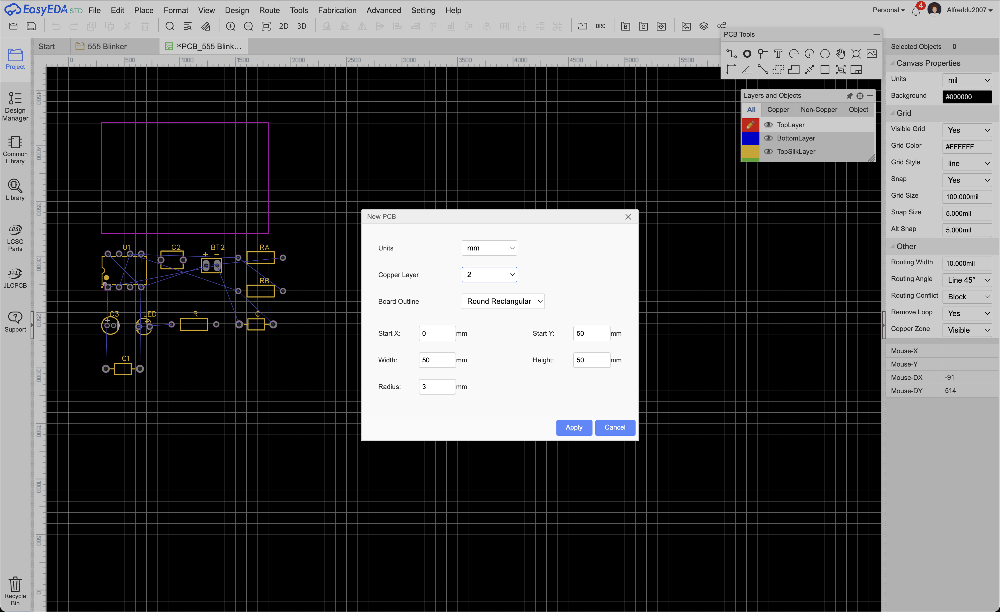

# PCB Design - Project

**Prerequisite:** complete [PCB Design - Concepts](PCB%20Design%20-%20Concepts.md) (Part 1 and Part 2) before starting this walkthrough.

Now that you've been introduced to the foundational concepts behind circuits, this document will help you apply these concepts by taking a real chip and turning it into a working, manufacturable board for a specific, real design.

By the end of this guided activity, you'll be able to read and interpret datasheets, build schematics, source real parts, and lay out a fully routed PCB.

## Goal

Design a circuit that blinks an LED using an LM555 timer integrated circuit (IC), with these specifications:

- $1Hz$ frequency (the LED blinks once per second)
- $66.7\%$ duty cycle (ON time / TOTAL time)
- 9V battery supply

## The LM555

The 555 timer is one of the most produced ICs ever made. It's a small, cheap, general-purpose chip that can generate precise timing pulses or oscillate continuously, using nothing but a couple of resistors and a capacitor to set the timing. It shows up everywhere: blinking LEDs, tone generators, PWM motor drivers, debounce circuits, etc.

It has three basic modes of operation: Monostable, Astable, and Bistable. We will only be focusing on the Astable mode of operation for this assignment, since we want a continuously blinking LED.

The datasheet for the specific part we're using, the Texas Instruments LM555, can be found here: [lm555.pdf](lm555.pdf)

## Step 1: Datasheet

Don't read the datasheet from cover to cover! A lot of the information will not be useful to us. Instead, here are the sections you typically want to look at when designing a PCB:

- Schematics/wiring diagrams
- Pinouts (pin mapping)
- Output equations
- PCB layout suggestions

First, find the following sections:

- Section 5 — Pinout
- Section 7.4.2 — typical application in Astable mode

### The pinout

An IC's pinout identifies each pin's purpose and location. Pins are always numbered counterclockwise, starting from the top left. From **Pin Configuration and Functions** on page 3 we can find a diagram of the IC:

You can ignore the internal circuitry of the chip, since this is not important to us. Next, briefly read the **Pin Functions** table which gives us more detail.

This table gives us a good idea of each pin's purpose. It will be helpful in conjunction with the example schematic in Astable mode.

### The output graph

Next, we'll jump around a bit. Let's inspect the output waveform of the circuit. Scroll to **Device Functional Modes (continued)** on page 11:

The top trace on the graph is the output voltage, and we can see that for a $V_{CC} = 5V$ input, we get a square wave output that is $V_{CC}$ when HIGH and $0V$ when LOW.

### The Astable application circuit

Now, check **7.4.2 Astable Operation** on page 10:

Don't worry if this schematic looks scary right now! We'll break it down into manageable parts during design. For now, let's focus on the $R_L$ load resistor. This resistor just represents any load we attach — in this case, it represents our LED (and current limiting resistor). If we scroll up to the monostable operation schematic on page 9, we can see that we have the option to select from two load configurations, and this holds true for Astable mode too:

1. We can place it between pin 8 ($V_{CC}$) and pin 3 (output). When output goes HIGH, the voltage on both ends = $V_{CC}$, so there is no voltage across our load and our LED turns off. When output goes LOW, the voltage across our load = $V_{CC}$ and the LED turns on.
2. We can place it between pin 3 and GND. When output goes HIGH, the voltage across our load = $V_{CC}$ and the LED turns on. When output goes LOW, both ends = $0V$ and the LED turns off.

Make sure you understand this concept, since you will need to figure out which configuration will work in our circuit (only one will work).

### The transfer equations

Next, let's take a look at the equations below:

These tell us that we can tune the IC's output waveform to match our specs ($1Hz$ and $\large\frac{2}{3}$ duty cycle) by selecting values for $R_A, R_B,$ and $C$. Let's use the equations for total period and duty cycle to select the values for our components.

### Finding component values

In most circuit design problems like this, there are many theoretical solutions. In other words, there are infinitely many ways to choose $R_A, R_B,$ and $C$ in order to achieve our desired period/duty. However, we are limited by real component values.

For example, it would be really hard to find a $10F$ capacitor, and that would also force our resistor values to be super small. We want to aim for standard values that land somewhere in the middle of the spectrum for each component.

For resistors $R_A$ and $R_B$, we want to choose something in the $k\Omega$ range at a standard value (e.g. $1k, 47k, 100k$). This prevents the IC from drawing too much current. For capacitors, we want to choose small values in the $pF$ to $\mu F$ range, since this is the range of ceramic capacitors.

First, let's try to derive a relationship for the duty cycle of our LED. We are given that $D = \Large\frac{R_B}{R_A + 2R_B}$ (this is Equation 5 from the datasheet, and it's the fraction of the period the output spends LOW), and we want our LED ON for $\large\frac{2}{3}$ of the period. Do you notice an issue?

No matter how we select $R_A$ and $R_B$, the highest $D$ value we can achieve is $0.5$. Since $D$ is the LOW-time fraction, that means an LED tied to the output's LOW phase (Configuration 1) can be on for at most $50\%$ of the period, no matter what resistors we pick — it can never reach $2/3$. To hit our target, we instead need the LED on during the output's HIGH phase, so we must design our LED as **active-high** (Configuration 2: LED off when the output is LOW, on when it's HIGH). The LED's on-time fraction is then $1-D$, not $D$. Using $R_A$ = $47k\Omega$, choose the right value of $R_B$ so that $1-D = \large\frac{2}{3}$ (i.e. $D=\large\frac{1}{3}$), and note the correct load configuration for later.

Now that you have $R_A$ and $R_B$, you should be able to derive a value for $C$. If you did it correctly, $C$ will be in the $\mu F$ range. Round $C$ to the nearest $\mu F$.

### Finding component values — LED circuit

Next, let's find component values for our load, which will consist of an LED and a resistor. Since an LED has a very low internal resistance, connecting it directly to voltage HIGH will cause it to draw too much current and burn out instantly. Because of this, we have to use a current limiting resistor in series with the LED as our load.

An LED is typically bright enough at $20mA$. Knowing the voltage of $V_{CC}$/HIGH and assuming the LED's forward voltage $V_f = 2V$, what resistor value $R$ should you choose?

Your answer should fall in the $\Omega$ range. Some standard resistor values for this range are 100$\Omega$, 150$\Omega$, 220$\Omega$, 330$\Omega$, 470$\Omega$, and 680$\Omega$. Pick the value that is closest to your calculated $R$.

### Summary of components

- $R_A$ & $R_B$ — feedback resistors
- $C$ — capacitor between pin 6 and ground
- $R$ — current limiting resistor for the LED
- $0.01 $\mu F$ capacitor between pin 5 and ground
- $9V$ battery
- LM555 IC
- Red LED (**LCSC C2895470**)

## Step 2: Create the EasyEDA project

With every value calculated on paper, open EasyEDA and create a new project named `LM555 Blinker`. You'll build the schematic and board in the steps below.

## Step 3: Import the LM555 into EasyEDA

With every value calculated on paper, it's time to bring the actual part into your EDA tool.

1. Open EasyEDA and start (or open) your schematic.
2. Use the parts search bar and search "LM555". You'll see a number of results from different manufacturers (TI, ON Semi, STMicro, etc.), since 555 is a generic, second-sourced part, not one company's proprietary design.
3. Pick a result and check that its symbol matches the pinout you just read: 8 pins, named GND, TRIGGER, OUTPUT, RESET, CONTROL VOLTAGE, THRESHOLD, DISCHARGE, and $V_{CC}$. If a listing's symbol doesn't match, or is missing pins, keep looking, don't assume the search result is correct just because the name matches.
4. Check the available packages against what the datasheet lists in its Device Information table (SOIC-8, PDIP-8, VSSOP-8). For this project, pick the **SOIC-8** package: small enough to be practical, but still hand-solderable, unlike the tiny VSSOP.
5. Drop the symbol onto your schematic canvas.

You should end up with a blank sheet and a single U1 symbol showing all 8 pins, sitting on your title block, exactly like above.

## Step 4: Place the Power Supply and Wire VCC/GND

Before wiring up the timing network, get power onto the sheet. This project is powered by a simple battery pack, so drop a battery symbol (BT1) next to the LM555.

Rather than drawing a wire all the way from the battery to the IC (which gets unreadable fast once a schematic has more than a couple of parts), give each battery terminal a net label instead: `VCC` on the positive terminal, `GND` on the negative one. Any pin anywhere on the sheet with the same net label is electrically the same node, EasyEDA doesn't care how far apart they are drawn.

Add the actual ground symbol on the `GND` side too (the downward-pointing "GND" symbol, not just a text label), it's a schematic convention that makes ground connections instantly recognizable at a glance.

Once it's wired, it's worth boxing the battery section off and labeling it (here, "Battery Supply"). This is purely cosmetic, a visual grouping to keep the sheet organized as it grows, but it's a habit worth building early: a schematic that's easy to read is a schematic that's easy to debug.

Now go back to U1 and wire the pins that connect straight to power: pin 1 (GND) to the `GND` net, pin 8 ($V_{CC}$) to the `VCC` net, and pin 4 (RESET) also to `VCC`, since we're not using the reset function and the datasheet says to tie it high when unused.

## Step 5: Import the Real Parts by Part Number

Having a value on paper (like "$48k\Omega$") isn't the same as having a purchasable part. In practice, this is where you'd go pick real resistors and capacitors matching what you calculated in Step 2, by browsing a supplier like LCSC and checking package, tolerance, and voltage rating until you land on a part number for each.

This guide assumes you've already been through that process and have LCSC/JLCPCB part numbers picked out for $R_A$, $R_B$, $R_{LED}$, $C$, $C_{bypass}$, and $C_{ctrl}$ (matching the values from Step 2, since notice the resistor and capacitor symbols on this schematic are deliberately left without value labels, filling those in correctly is on you). Importing a part you already have the number for is the easy part: in EasyEDA, open the **LCSC Parts** panel, paste the part number directly into the search bar, and drop the exact match onto your sheet. No browsing or filtering needed once you know exactly what you're looking for.

For the LED, you don't need to go part-hunting either, use **`C2895470`**. Search that part number the same way, drop it on the sheet as LED1, then open its datasheet and check its actual $V_f$ at your target current against the $2V$ we assumed back in Step 2. If the real part's $V_f$ is meaningfully different (say, $1.8V$ or $2.2V$), go back and recompute $R_{LED}$ with the real number rather than leaving your assumed value in the design. This loop, assume a value, pick a real part, verify the assumption, correct if needed, is a big part of what part selection actually looks like in practice, even when the part number is handed to you.

## Step 6: Finish Wiring the Astable Network and LED

With power on the sheet, build out the rest of the astable topology from Step 1, pin by pin. Working through each signal pin one at a time (rather than trying to wire the whole thing at once) makes it much easier to keep track of what's connected and what's still a dangling stub.

Start with pin 5 (CONTROL VOLTAGE): add $C_{ctrl}$ from that pin to `GND`, per the datasheet's layout recommendation to bypass it even when it's not actively used.

Next, tie pin 7 (DISCHARGE) and pin 6 (THRESHOLD) together, and run $R_B$ off of that node to a new net label, `TRIG`, which also feeds pin 2 (TRIGGER). This is the Node A / Node B split from Step 1's astable topology, drawn out with net labels instead of long wires.

Finish the timing network with $R_A$ back up to `VCC`, and add the LED branch off of pin 3 (OUTPUT): $R_{LED}$ in series with LED1's anode, LED1's cathode to `GND`. Remember that current in a diode flows in the direction of the triangle (anode → cathode):

Finally, drop the timing capacitor $C$ from the `TRIG` node down to `GND`, completing the RC network that sets your frequency and duty cycle.

Zoom back out and give the whole thing a look. You should have two labeled blocks, Battery Supply and your 555 circuit, with every pin on U1 connected to something and no dangling stubs left.

At this point you have a complete, simulatable schematic that meets both specs on paper: every net labeled, every part placed, and (once you fill them in from Step 2) every resistor and capacitor carrying the right value.

## Step 7: From Schematic to PCB

Schematic and board layout are deliberately separate steps, the schematic only describes *what connects to what*, never *where anything physically sits*. Once your schematic is complete and DRC-clean, convert it to a PCB (in EasyEDA: **Design → Convert Schematic to PCB**). Every symbol becomes a footprint, dropped onto a fresh PCB canvas, and every wire becomes a "ratsnest" line, a straight, unrouted airwire showing you what still needs a copper trace between it.

Before touching any footprints, define the physical board itself: its outline shape and size. Here, a rounded-rectangle outline is set to $60mm \times 40mm$ with a $2mm$ corner radius, small enough to be cheap to fabricate, but with enough room to place every part without things overlapping.

## Step 8: Place Footprints and Route the Board

With an outline defined, arrange the footprints inside it. A few things worth thinking about while placing parts:

- Keep $C_{bypass}$ physically close to U1's $V_{CC}$ pin, exactly the kind of layout-only decision that doesn't show up on the schematic at all.
- Give the battery holder (BT1) and the LED room near the board edge, since both are likely to be user-facing or need to be accessible once the board is in an enclosure.
- Leave enough spacing between parts that traces have room to route without crossing (on a 2-layer board, a trace can hop to the bottom layer to avoid a collision, but it's still easier to avoid the problem in placement than to fix it in routing).

Once placement looks reasonable, route a trace along every remaining ratsnest line until none are left. Below is the finished board: LED1, $R_L$ ($R_{LED}$), $R_A$, $R_B$, $C_1$ ($C_{ctrl}$), $C$, and U1 all placed and fully routed, with BT1's holder along one edge.

It's worth doing a final visual pass with ratsnest lines toggled back on, any net that still shows a straight airwire instead of a routed copper trace means you missed a connection, and that's much cheaper to catch now than after the board comes back from fab.

## Step 9: Add Mounting Holes and Finish the Board

Last, add mounting holes so the board can actually be screwed into an enclosure or stacked with standoffs. Zoom into each corner and place a hole a fixed, consistent distance in from both edges, here, $5mm$ from each edge, so all four corners match.

Set the hole's diameter to give clearance for the screw you're actually using, here $3.3mm$, sized for an M3 screw (M3 is $3mm$ nominal; a bare $3mm$ hole would bind on the threads, so real designs always add a bit of clearance).

Repeat for all four corners, and your board is complete: outlined, placed, routed, and ready for fabrication.

## What's Next

You now have a finished, routed PCB that meets both specs on paper and is ready to send to a fab. From here, the remaining steps are mostly mechanical: run a final DRC (Design Rule Check) to catch any spacing or clearance violations, generate manufacturing files (Gerbers and drill files, or use EasyEDA's direct JLCPCB ordering integration if you're using their basic parts), and place your order. Once the bare boards and parts arrive, you're on to assembly and bring-up, checking the board actually does what the schematic said it would.

## Checkpoint Questions

1. Using Equation 5, $D = \frac{R_B}{R_A + 2R_B}$, show algebraically why $R_A = R_B$ gives $D = \frac{1}{3}$, so the LED on-time $1-D = \frac{2}{3}$.

2. Suppose instead you used $R_B = 2R_A$ (not equal). What duty cycle $D$ would that give? What would the LED on-time fraction $1-D$ be for an active-high LED?

3. Redesign this circuit for $f = 2Hz$ instead of $1Hz$, keeping $R_A = R_B$ and the same timing capacitor. What resistor value do you need? Is it closer to a standard value than our $1Hz$ design was?

4. Why does the datasheet's Recommended Operating Conditions table matter here? What would happen electrically if you tried to run this circuit at $V_{CC} = 20V$?

5. We assumed the LED forward voltage was $2V$. If you picked a real LED and its datasheet says $V_f = 1.9V$ at $10mA$, recompute $R_{LED}$. Is the difference big enough to matter?

6. Why does $C_{bypass}$ need to be placed physically close to U1's $V_{CC}$ pin on the PCB, when the schematic shows no difference between that and placing it on the opposite corner of the board? What could go wrong electrically if the trace between them were long?

7. The mounting holes were placed $5mm$ from the board edges with a $3.3mm$ diameter for an M3 screw. If you instead wanted to use an M2.5 screw, what diameter would you choose, and why not just drill the hole at the screw's exact nominal diameter?
