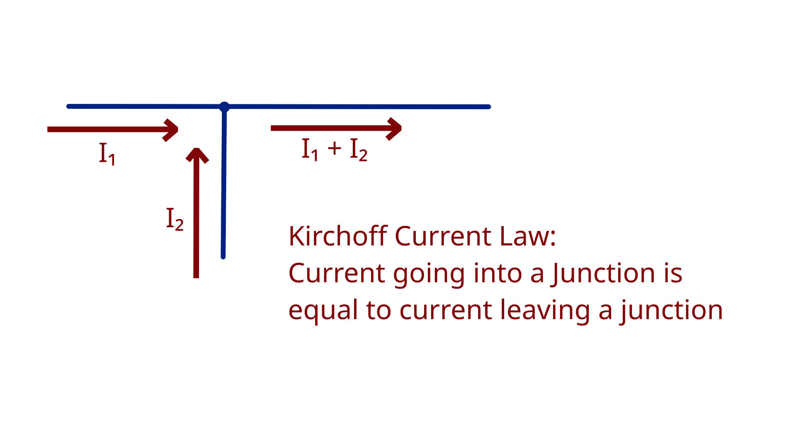
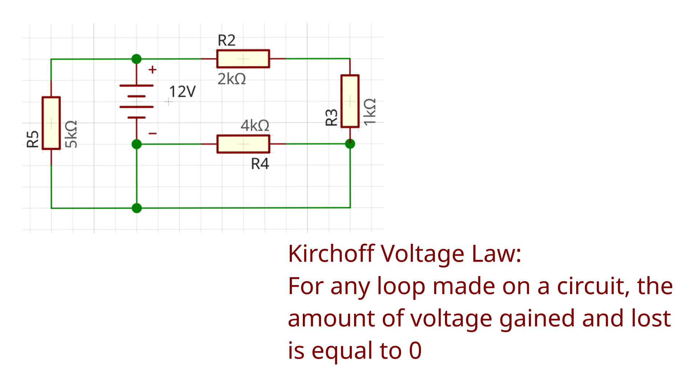
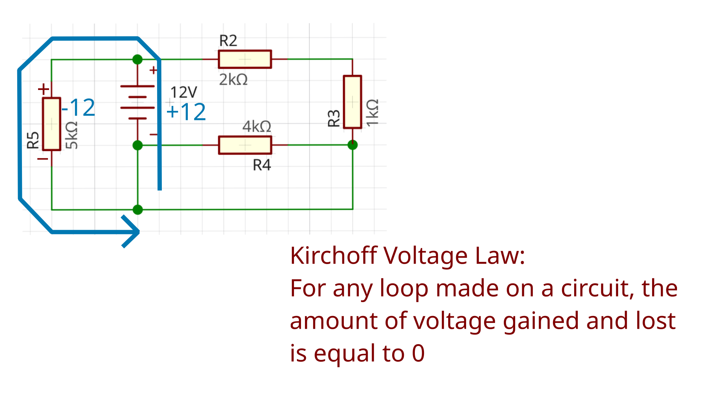
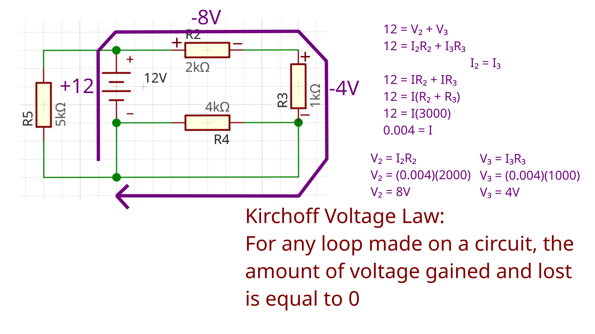

# Circuit Analysis and more into PCBs

## Circuit Analysis Basics

Today we're going to start off talking about circuit analysis. The key equations that matter when doing circuit analysis is Ohm's Law, KCL, and KVL. Ohm's law we've gone over before, and it is 

$$
V = IR
$$

The next equation is KCL, which is Kirchoff's Current Law. Kirchoff's Current Law states that all current flowing into a junction must also flow out of that junction, like so.

This has the added implication that all components in series have the same amount of current flowing through them.

The next rule is Kirchoff's Voltage Rule, which states that given any loop on a circuit, the amount of voltage gained and lost is equal to 0.

Let's look at a loop in this circuit, the teal loop.

You gain 12V at the battery, which means that you have to lose 12V on this resistor to get back to 0V at the end, and that's what happens.

Now, lets look at another loop, which I've colored this time in purple, 

You can see that at the start of the loop, you gain 12V from the battery. This time you know that you have to lose 12V on R2 and R3. Ohm's law tells you that $V_2 + V_3 = I_2R_2 + I_3R_3$. Because of Kirchoff's Loop Rule, we know that the current I going through both resistors is the same, you can say that the total voltage 12 is equal to $I(R_2 + R_3)$, which gets you a current of 0.004. This gets you a voltage dissapated of 8V in R2 and 4V in R3.

If this doesn't make sense, you should watch Curt Schurger's ECE 35 Lecture videos, specifically [this](https://www.youtube.com/watch?v=fjlchV14wUk&list=PLLDpFymVGR_cEbovUed4v1fvSXxBGATA-&index=9) one on KCL and KVL. This has the entire playlist, and his videos are literally what is taught in every ECE 35 class so its a great place to learn the Electrical Engineering basics.

