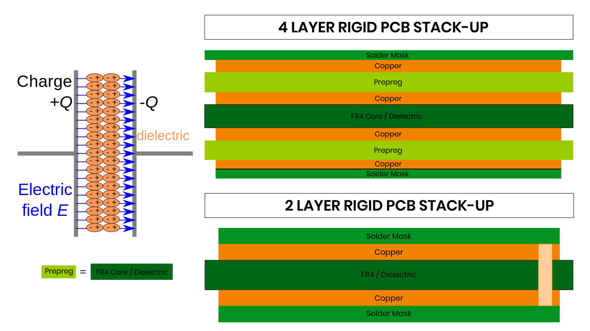
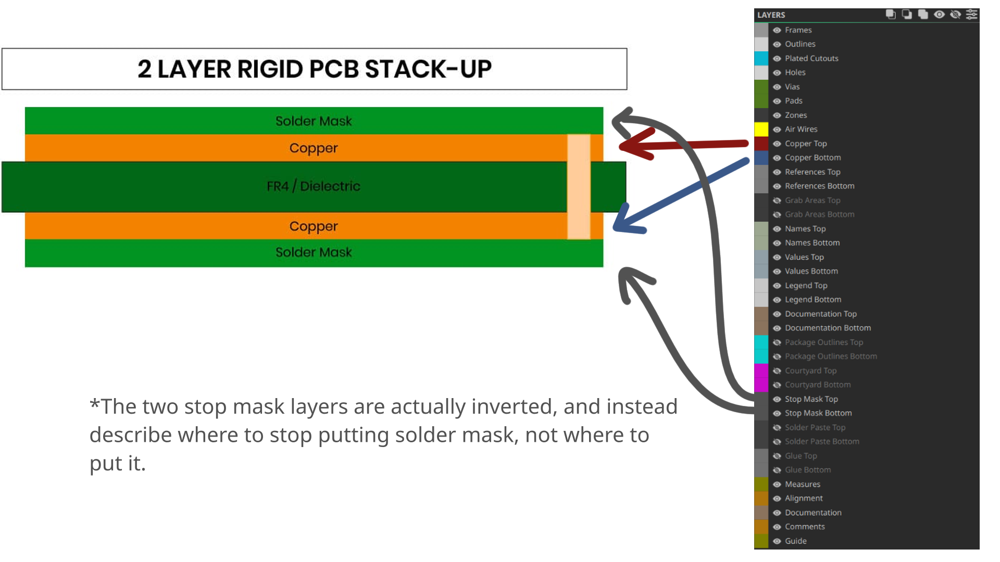
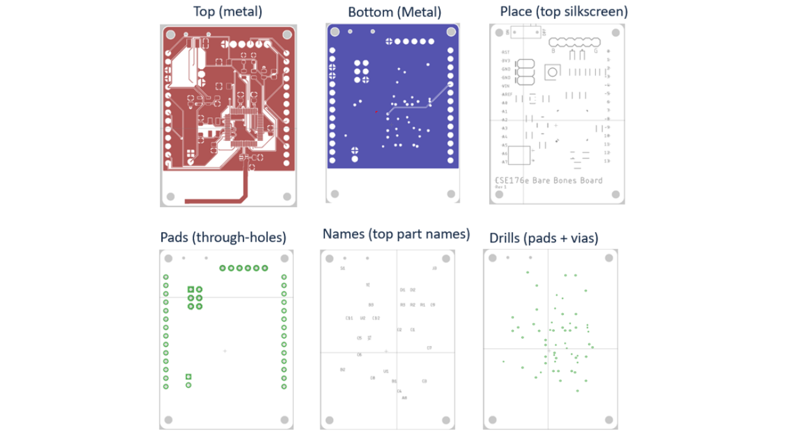
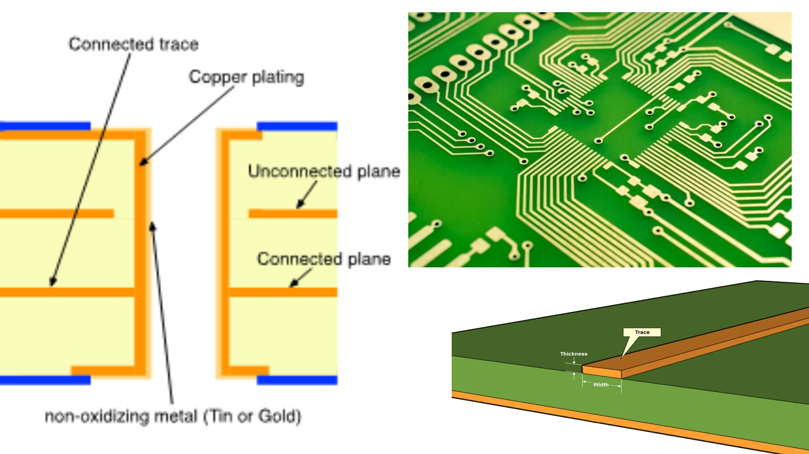
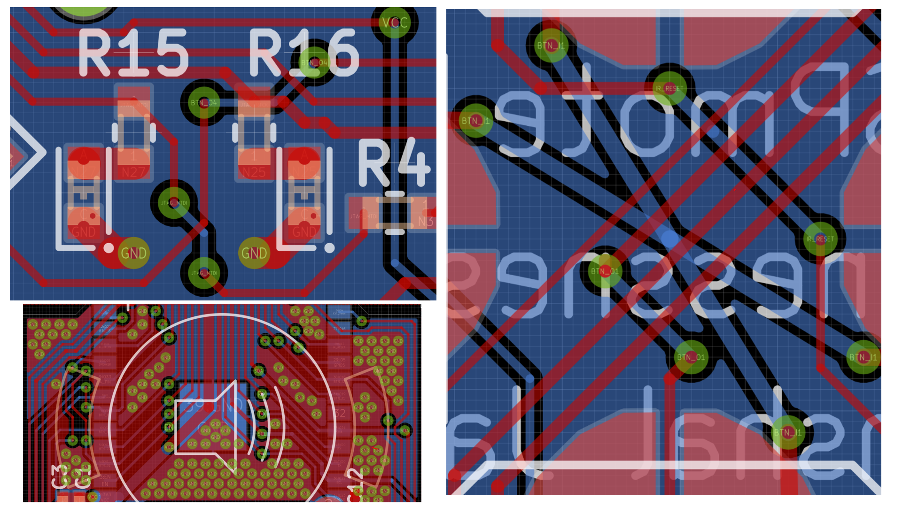
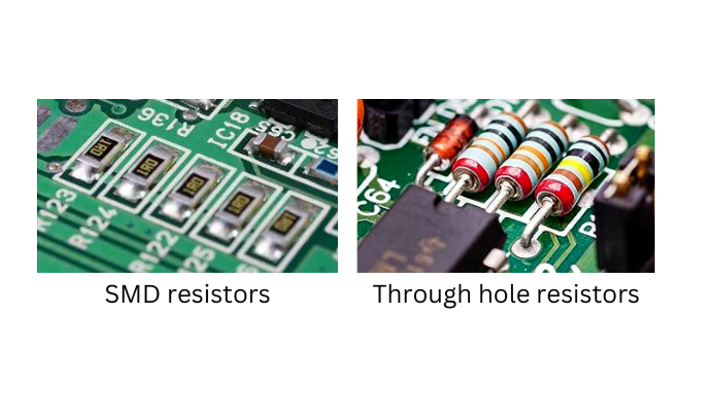
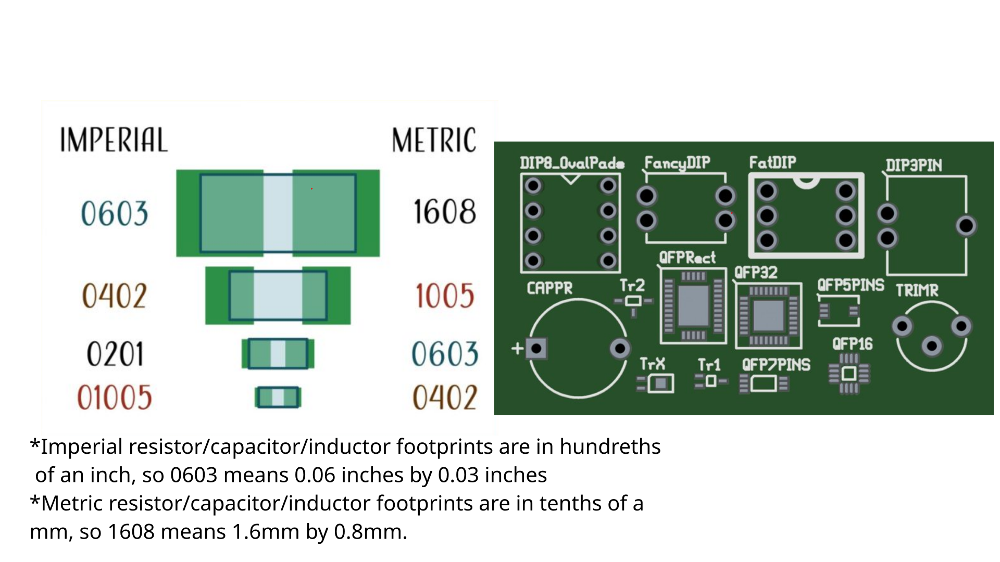

# Circuit Analysis and more into PCBs

## Circuit Analysis Basics

Today we're going to start off talking about circuit analysis. The key equations that matter when doing circuit analysis is Ohm's Law, KCL, and KVL. Ohm's law we've gone over before, and it is 

$$
V = IR
$$

The next equation is KCL, which is Kirchoff's Current Law. Kirchoff's Current Law states that all current flowing into a junction must also flow out of that junction, like so.

This has the added implication that all components in series have the same amount of current flowing through them.

The next rule is Kirchoff's Voltage Rule, which states that given any loop on a circuit, the amount of voltage gained and lost is equal to 0.

Let's look at a loop in this circuit, the teal loop.

You gain 12V at the battery, which means that you have to lose 12V on this resistor to get back to 0V at the end, and that's what happens.

Now, lets look at another loop, which I've colored this time in purple, 

You can see that at the start of the loop, you gain 12V from the battery. This time you know that you have to lose 12V on R2 and R3. Ohm's law tells you that $V_2 + V_3 = I_2R_2 + I_3R_3$. Because of Kirchoff's Loop Rule, we know that the current I going through both resistors is the same, you can say that the total voltage 12 is equal to $I(R_2 + R_3)$, which gets you a current of 0.004. This gets you a voltage dissapated of 8V in R2 and 4V in R3.

If this doesn't make sense, you should watch Curt Schurger's ECE 35 Lecture videos, specifically [this](https://www.youtube.com/watch?v=fjlchV14wUk&list=PLLDpFymVGR_cEbovUed4v1fvSXxBGATA-&index=9) one on KCL and KVL. This has the entire playlist, and his videos are literally what is taught in every ECE 35 class so its a great place to learn the Electrical Engineering basics.

## More into PCBs

Your basic PCB is a two layer PCB. This is two layers of copper traces with a layer of a dielectric in between. If you remember from last week, this is in fact the same way that a capacitor is made. In fact a PCB is a very weak passive capacitor. This means that if you place a plane of ground underneath your signal (or power) traces, your signals are more robust to noise (and emf as well in fact, which is something I'll go into later).

If you require more protection from emf and more layers for routing things, you'll want to use a four layer pcb, which gives you more options for routing things, and sometimes is desired for the ability to separate out your layers more and have a more robustly routed pcb. 

There are a number of ways to stack up your layers on a four-layer pcb, and these all have different benefits and drawbacks. Some common practices are [Ground Signal Ground Power], [Signal Ground Signal+Power Ground]. We will go over the pros and cons of those later, but its good to try to think to yourself why one might be preferred over the other.

### Layers

All PCB design is done on layers. If you draw on the silkscreen layer, you'll get documentated silkcreen printed on the top of of your board. If you draw on the top copper layer, the traces will show up on the top copper,etc. In terms of layers the ones that you actually worry about mostly are silkscreen and your 2,4, or more copper layers. Soldermask is relevant but more about making footprints, since each part's footprint will have baked in where the copper should be exposed to solder that part.

Lets look at a board and what all the layers look like all at once.

You can see that the bottom plane is the ground plane, it is full and very rarely interrupted, and the top plane is the main plane for signal and power. You can also see the silkscreen on its own layer. This is how we send the board to a manufacturer and how they know how to make the board the way we want.

### Traces

Traces are your main method of connection in a pcb, and consist of lines on the copper layers that connect two points together electrically. These are basically your PCB equivalent of your wire. The main thing you need to consider with traces is their width, because as we remember from last week, a trace's width is inversely proportional to its resistance, and that also plays into how much amperage you can run through it.

A wire's max amperage mainly has to do with how much heat it can handle. In theory you could run any amount of amperage through a trace, but very quickly your wire would heat up, expand, and then break itself. 

Generally you can find [calculators online](https://www.advancedpcb.com/en-us/tools/trace-width-calculator/) that tell you how wide of a trace you want for a given amperage, but my general rule of thumb is 0.3-0.5 for signal traces and as wide as I can fit into my pcb (provided that it's larger than the minimum that I found on the calculator) for a power trace. This usually ends up being something in the realm of 0.8mm width, but if you're going to do more than 1A you probably want to increase the thickness of your copper up from the default of (1oz). 

As an aside, one thing to note is that trace thickness is often referred to in oz/ft^2 and not actual thickness. The default option on jlcpcb is 1oz, but if you're doing higher power and higher amperage electronics, you might want to make your traces thicker.

### Vias

Vias are how you connect traces from different layers together. You often can't route things with just traces (You should as much as you can if possible), so you have to change layers around with vias.

You can see this on the top left and right of the two photos, where I use vias to have traces route through and across each other. This is the main use of vias. If you are however worried about the thickness of traces, or about the robustness of your ground plane, as I was when designing this pcb, you can use vias to "stitch" your two layers together. We will discuss this more later, but basically you want your ground plane to be as uninterrupted as possible so that there is the least resistance between any two points of your ground plane. 

Via stitching is a way to artificially add more metal to your  traces/planes, and thus decrease resistance, because vias themselves (If you remember from the previous slide), are drilled out sections lined with metal. However, this is only seldom needed: either when you are working with very high amperages or when you want to reduce resistance on a ground plane.

### PCB Footprints

PCB footprints come with two main distinctions, through hole and smd. 

Through hole parts go through your board and are often larger, but are considerably easier to solder. SMD components are mounted on the surface of one side of the board and are often much much smaller.

The footprint of a part is basically its size on the board, as well as the necessary pads for it to solder onto the board properly, as well as the size of the physical part so that you don't accidentally overlap parts. The pads that are part of the footprint are what the parts that you solder on connect to directly.

Footprints all have names and codes so that you can look at a part, read it's footprint, and get a general size/shape of the part.

On the left here you can see the most common footprint, the smd resistor, capacitor, and inductor footprint. The notation for this is four numbers in a row, where each pair of numbers is one dimension. The problem with this is that you need to keep in mind whether your 0603 is a metric 0603 or an imperial 0603. Not three weeks ago I made this mistake, I ordered something in the realm of like 30 parts, and while most of them were imperial 0603 as i wanted, two of those parts were a metric 0603, which means that I was stuck soldering parts that were 0.6mm by 0.3mm. FIND ME THE PERSON WHO CAN HAND SOLDER 0201 WITH EASE BECAUSE I WILL SHOOT THEM THEY ARE NOT HUMAN. Anyway, be careful with what you order.

On the right side you can see some footprints for ICs, the through hole ones you can see are far bigger for fewer pins than the smd parts, however to solder the QFP ones you need a stencil and a hot plate or oven, because once you place the part down you can't even see the solder paste to access it to try and do by hand.

## Design Checks

When you are designing your board, you can run an Electrical Rules Check, or ERC, and this will tell you if you are exceeding the baseline rules in your PCB rules. For example, placing traces too close together (or even overlapping traces that shouldn't touch), if you have components too close together and they might overlap, or if you have vias that have no purpose, to name a few. It's important to understand the errors or warnings that you see, and to know if you care about the warnings or errors or if you can ignore them. If you can fix an error, you should, but if you can't you need to know if you can ignore it or not.

### [INSERT IMAGE OF SOME DESIGN RULE CHECKS FROM EASYEDA]

### Board Design Requirements

The first constraints you should consider when designing your board is mechanical constraints. Some things need to be in specific locations, and if you have mandatory mounting holes you should place those first (If you don't, at the end of the board design process, you can just put a few mounting holes wherever you have room). Also something to consider is use. If you have a horizontal connector, that probably needs to be on the edge of a board, and for vertical connectors you should make sure that you fingers have enough room to work with that connector. Remember that sometimes boards are deep inside the robot and you need to reach your hand deep inside and manipulate wires.

### [Insert Relevant Image]

Once you place down your parts, you need to keep some electrical/emf things in mind. If you have antennas, are they prone to digital interference? If you have decoupling (anti noise) capacitors, they should be as close to the part they are decoupling, which is often as near to the IC that you're trying to decouple as possible. You should keep noisy power and ground (like that from motors) away from especially analog, but also digital logic. 

You should also consider ease of routing when placing parts, parts that connect should be very close physically. Ratlines (lines that show pads or nets that should be connected) should be smaller and overlap as little as possible so that you can run shorter traces with less overlaps. Shorter traces means less impedance and less overlaps means less critical vias and also less impedance.

As an aside, it's recommended that you set your board grid to 1mm, with 0.5mm alternate. 

### Trace Routing

When routing traces, remember that sometimes wires or pins look connected but arent, this is something that ERC should tell you so make sure to check that regularly.

Traces should never turn sharply. Generally, this is accomplished with 45 degree bends on all turns, and for consistency it's generally good practice to keep your traces in increments of 45 degrees, but there may be some times where you need to break this rule to keep more important rules. 

If you are doing high amperage traces, maybe instead use copper areas.

It's always very good practice to have a ground plane as one of your layers and to interrupt that layer as little as possible. The more you interrupt your ground layer, the more choke points you're creating, and as we know thinner wire has more resistance. When you have more resistance between two points on the ground plane, you run the risk of there being a difference in voltage between those two points on the ground plane and this can cause issues with precise components that need their ground to be consistent.

## [INSERT PARTS ABOUT ELECTRICAL NOISE, SLIDE 19-20 from Electronics Training #3]

## Assignment:

Lets now make a board based on the previous week's schematic. Remember to use the rules we talked about in this week to create a solid robust board. 

##### Notes to self:

include stuff about not breaking the ground plane, keeping ground plane as intact as possible to reduce choke points and voltage differentials, and using via stitching to bypass that in times of need.

Use earlier version of peter's imu board as an example of this? (ask permission and find an old screenshot), or make my own example of a bad ground plane.
